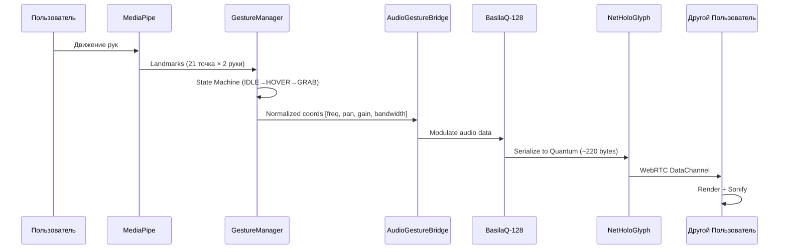

# Объяснение: Как Работает Holographic Media

*Адаптировано на основе концепции Anthropic Claude 4.5 Sonnet*

---

## Коротко: О Чём Речь?

Представь, что ты видишь на экране (или в XR-очках) красивую анимированную 3D-фигуру — это наша "голограмма". Она танцует под звуки вокруг тебя: музыку, твой голос, шум города.

Но это не просто красота. Это — закодированный звук. Как буква на бумаге: ты её видишь глазами, но она ещё и звучит, когда её произносишь.

Наша голограмма — это визуальный звук. Камера может на неё посмотреть и понять, что там звучит. Плюс ты можешь жестами управлять этой голограммой и даже "говорить" жестами.

---

## Как Это Работает?

### 1. Звук → Голограмма

- Микрофоны (лучше всего в XR-очках) слышат звук вокруг тебя (360°).
- Программа анализирует звук и рисует 3D-столбики: чем громче звук на определённой ноте, тем ярче или выше столбик.
- Получается живая, дышащая картинка — голограмма.

**Зачем?** Звук становится видимым. Камера может "посмотреть" на голограмму (128×128 пикселей) и понять, что там звучит. Как QR-код, только живой.

---

### 2. Голограмма → Звук

- Камера "смотрит" на изменение яркости столбиков.
- Программа расшифровывает звук или текст (если это была речь).

**Фишка:** Можно передавать звук картинкой. Навёл камеру на чужую голограмму — услышал, что там звучит.

---

### 3. Жесты → Команды и "Речь"

- Ты показываешь жест и одновременно говоришь: "Привет".
- Программа запоминает: "Жест №5 = слово 'Привет'".
- Потом ты снова показываешь Жест №5 — программа "произносит" или пишет "Привет".

**Можно дальше:**
- Показываешь цепочку жестов и говоришь предложение: "Как дела?".
- Придумываешь один новый жест для всей цепочки.
- Теперь одним жестом ты "говоришь": "Как дела?".

**Результат:** Ты можешь молча "говорить" жестами — программа переведёт их в голос или текст. Как язык жестов, который ты сам придумываешь.

---

### 4. Код → Голограмма → Жесты

- Любой код можно превратить в голограмму.
- К ней привязываешь жест.
- Показываешь жест — программа выполняет код.

---

## Зачем Всё Это?

- **Общение без слов** (в шумном месте или если горло болит).
- **Быстрое управление** гаджетами жестами (вместо кнопок).
- **Креатив:** создавай свои "слова" из жестов и делись с друзьями.
- **Для людей с особенностями:** кто не может говорить — "говорит" жестами, кто плохо слышит — видит звук.

---

## Что Готово?

✅ **Работает:**
- Голограмма под звук в реальном времени.
- Трекинг рук и запись жестов.

🔄 **В разработке (v0.19.050+):**
- **Инфраструктурный суверенитет:** Фазовая миграция на Cloudflare-native (R2 хранение, Workers сигналинг, D1 кэш). Текущий бэкенд: FastAPI на Koyeb + Astra DB.
- **Edge Computing:** Устройства пользователей (Snapdragon 8 Gen 5/6, 300+ TOPS NPU) могут вносить вычислительные мощности для распределённого рендеринга общих голограмм.
- **Native HoloGraph Blockchain:** Собственный L1-блокчейн для пространственного консенсуса (Spatial Ledger). Без внешних токенов из Топ-100.
- **Code Audit:** Прямой просмотр и откат версий кода через встроенный Monaco Editor.
- **Синхронизация:** Обмен голограммами через WebRTC P2P + WebSocket-сигналинг.

---

## Простая Аналогия

Как учишь собаку: показываешь жест → говоришь "Сидеть" → собака запоминает. Потом жест без слов — собака садится.

Наша программа так же, только ещё "видит" звук и передаёт его через картинку.
# Архитектура Потоков Данных и Взаимодействия Проекта "Голографические Медиа"

## 1. Введение

Этот документ описывает высокоуровневую архитектуру, ключевые компоненты и потоки данных проекта "Голографические Медиа" (holograms.media). Цель проекта – создание инновационной мультимодальной платформы для взаимодействия человека с информацией и AI через динамические 3D-аудиовизуализации ("голограммы"), а также разработка самообучающегося AI-ассистента "Триа".

## 2. Технологический стек и ключевые компоненты

- **Frontend:** Одностраничное приложение (SPA), написанное на чистом JavaScript (ES6 Modules).
  - **Рендеринг:** Three.js с использованием **WebGL** для высокопроизводительной 3D-графики.
  - **Хостинг:** Cloudflare Pages (сборка происходит на Cloudflare Pages).
- **Backend:** Приложение на **FastAPI** (Python).
  - **Хостинг:** Koyeb (развертывание через Docker).
  - **Аутентификация:** **OAuth 2.0 с Google Sign-In**. FastAPI-сервис проверяет JWT-токены, выданные Google, и выпускает собственный JWT для сессии.
  - **Версионность:** Поддержка **Hot-Swap** (просмотр кода коммитов через `srcdoc` и встроенный **Monaco Editor**).
- **База знаний (RAG):** **Astra Database (Cassandra)** с доступом через **Tria API**. Используется для хранения и семантического поиска по всем данным проекта.
- **Хранилище файлов:** **Cloudflare R2** для хранения "чанков" взаимодействия (аудио, видео).

- **AI Оркестрация:** В перспективе планируется использование **Mistral LLM** для управления сложными AI-потоками, интегрированного в FastAPI бэкенд.

## 3. Архитектура потоков данных

### 3.1. Инициализация Frontend

1.  **Загрузка и DOM:** `main.js` запускает инициализацию после события `DOMContentLoaded`.
2.  **Согласие:** `initializeConsentManager()` запрашивает согласие пользователя.
3.  **Инициализация ядра (`initCore`):**
    - Создается глобальный объект `state`.
    - **Инициализация WebGL:** `initializeScene()` в `3d/sceneSetup.js` асинхронно настраивает `THREE.WebGLRenderer`. В случае неудачи (отсутствие поддержки, ошибка устройства) инициализация прекращается, и пользователю выводится сообщение об ошибке.
    - Создаются и сохраняются в `state` экземпляры ключевых менеджеров: `HologramRenderer`, `MicrophoneManager`, `AudioFilePlayer`, `PanelManager` и др.
4.  **Инициализация UI:** `initializeMainUI()` в `ui/uiManager.js` кэширует ссылки на все основные DOM-элементы в `state.uiElements`.
5.  **Определение платформы:** `detectPlatform()` определяет, на каком устройстве запущено приложение (desktop, mobile, xr), и динамически загружает соответствующие модули для управления вводом и макетом (например, `DesktopLayout`, `DesktopInput`).
6.  **Ожидание пользователя:** Приложение ожидает действия пользователя (например, нажатия кнопки "Start Session") для инициализации мультимедиа.

### 3.2. Сценарий: Взаимодействие с голограммой и Триа

Этот сценарий описывает полный цикл от действия пользователя до ответа системы.

**Шаг 1: Ввод пользователя и локальная обработка (Frontend)**

- **Визуализация аудио в реальном времени:**
  1.  Аудиопоток с микрофона (`MicrophoneManager`) или из файла (`AudioFilePlayer`) направляется в `audioProcessing.js`.
  2.  `audioProcessing.js` использует `AudioWorklet` (`waveletAnalyzer.js`), который передает аудиоданные в **WASM-модуль**, скомпилированный из Rust.
  3.  WASM-модуль выполняет непрерывное вейвлет-преобразование (CWT) и возвращает уровни громкости по частотам и углы панорамы.
  4.  Эти данные сохраняются в `state` и используются `HologramRenderer` в каждом кадре для обновления 3D-визуализации.
- **Захват "Чанка" для отправки на бэкенд:**
  1.  **Жесты:** `handsTracking.js` с помощью MediaPipe захватывает координаты ключевых точек рук.
  2.  **Аудио/Видео:** Пользователь может загрузить файл или записать аудио/видео.
  3.  **Формирование "Чанка":** Клиентский JavaScript формирует объект с метаданными (`timestamp`, `user_id` от Google OAuth 2.0) и готовит медиафайл к загрузке.

**Шаг 2: Отправка данных на бэкенд (Frontend -> Backend)**

1.  Клиент (через `services/apiService.js`) отправляет запрос на эндпоинт FastAPI бэкенда (например, `/api/v1/interactions/upload`). Запрос содержит метаданные и файл "чанка".
2.  Все запросы к FastAPI защищены. Клиент получает **JWT-токен** от Google OAuth 2.0 и прикрепляет его к каждому запросу в заголовке `Authorization`.

**Шаг 3: Обработка на бэкенде (FastAPI на Koyeb)**

1.  **Аутентификация:** FastAPI-эндпоинт с помощью зависимости проверяет JWT-токен, выданный Google, идентифицируя пользователя.
2.  **Валидация:** Pydantic-модели валидируют структуру входящих данных.
3.  **Сохранение файла:** FastAPI-сервис загружает медиафайл из "чанка" в **Cloudflare R2**.
4.  **Сохранение в базу знаний:** Метаданные "чанка" (включая `user_id` и ссылку на файл в R2) вместе с контентом отправляются через **Tria API** в **Astra Database (Cassandra)** для индексации и сохранения.
# 🌀 Манифест Кохлеарного Цилиндра

**Версия:** 1.0 (Draft)
**Дата:** 2026-01-17
**Статус:** Архитектурная Библия (Core Architecture)

---

## 1. Философия: От Плоского Экрана к Пространственному Звуку

Мы переходим от 2D-визуализации звука к **3D-соматической реальности**.

Экран — это **карта**. Tria оживляет эту карту в **территорию** вокруг пользователя.

```
┌─────────────────────────────────────────────────────────┐
│  ЭКРАН (2D Развёртка)                                   │
│  ┌─────────────────┬─────────────────┐                  │
│  │   LEFT GRID     │   RIGHT GRID    │                  │
│  │   (128 cols)    │   (128 cols)    │                  │
│  │   Purple→Blue   │   Blue→Red      │                  │
│  └─────────────────┴─────────────────┘                  │
│            ↓ ↓ ↓ PROJECTION ↓ ↓ ↓                       │
└─────────────────────────────────────────────────────────┘
                        ↓
┌─────────────────────────────────────────────────────────┐
│  РЕАЛЬНОСТЬ (3D Кохлеарный Цилиндр)                     │
│                                                         │
│           ╭───────────────────────╮                     │
│          /    HIGHS (Верха)       \   ← Узкие, точечные │
│         /     Индексы 96-127       \                    │
│        ├───────────────────────────┤                    │
│        │      MIDS (Середина)      │                    │
│        │      Индексы 32-95        │                    │
│        ├───────────────────────────┤                    │
│        \     BASS (Басы)          /   ← Широкие, 180°   │
│         \    Индексы 0-31        /                      │
│          ╰───────────────────────╯                      │
│                    ▲                                    │
│              [ПОЛЬЗОВАТЕЛЬ]                             │
│                                                         │
│  Радиус цилиндра: 344 метра (1 акустическая секунда)   │
│  **R&D Note (v0.19.050):** В визуальном пространстве   │
│  радиус `XR_RADIUS = 1000`. Камера смещена на Z = -800. │
└─────────────────────────────────────────────────────────┘
```

---

## 2. Геометрия: 256 Виртуальных Динамиков

### 2.1 Структура Цилиндра

| Параметр | Значение | Описание |
|----------|----------|----------|
| Радиус | 344 м | Скорость звука × 1 сек |
| Высота | 256 ед. | Индекс частоты (0 = SubBass, 127 = UltraHigh) |
| Септум | X = 0 | Вертикальная плоскость, делящая L и R |
| Динамиков | 256 | 128 Left + 128 Right |

### 2.2 Маппинг Индекса → Позиция

```javascript
function indexToSpatialPosition(index, pan) {
  const isLeft = index < 128;
  const freqIndex = isLeft ? index : index - 128;
  
  // Y (Высота): Низкие частоты внизу, высокие вверху
  const height = freqIndex / 127; // 0.0 → 1.0
  
  // Ширина "луча" динамика: Басы широкие, Верха узкие
  const baseAngle = isLeft ? Math.PI : 0; // L = 180°, R = 0°
  const spreadFactor = 1.0 - (freqIndex / 127); // 1.0 для басов, 0.0 для высоких
  const spreadAngle = spreadFactor * (Math.PI / 2); // До ±90° для басов
  
  // Pan модифицирует угол внутри полусферы
  const panOffset = pan * spreadAngle;
  const finalAngle = baseAngle + panOffset;
  
  // Радиус = 344м (константа для звука в воздухе)
  const radius = 344;
  
  return {
    x: radius * Math.cos(finalAngle),
    y: height * 256, // Масштаб в единицах цилиндра
    z: radius * Math.sin(finalAngle),
    beamWidth: spreadAngle, // Ширина "конуса" влияния
  };
}
```

### 2.3 Сенсорные Зоны

```
         0° (Right Center)
          │
    315°──┼──45°
          │
  270°────●────90°
          │
    225°──┼──135°
          │
        180° (Left Center)
```

**Правило Латерализации:**
- Индексы 0-127: Левое полушарие (90° → 270°)
- Индексы 128-255: Правое полушарие (270° → 90°)

---

## 3. Жестовый Язык: Intent → Code → Sound

### 3.1 Физика Взаимодействия

| Жест | Параметр | Mapping |
|------|----------|---------|
| Y (Вверх/Вниз) | Частота | 0-127 semitones |
| X (Влево/Вправо) | Pan | -1.0 to +1.0 |
| Z (К себе/От себя) | Gain | 0.0 to 1.0 (натяжение) |
| Thumb-Index Spread | Bandwidth | Ширина захвата частот |

### 3.2 Правило "Натяжения Струны"

```
Рука далеко от экрана (Z > 0.7):
  → Высокий Gain (громкость/интенсивность)
  → "Натянутая струна" — энергия в системе
  
Рука близко к экрану (Z < 0.3):
  → Низкий Gain
  → "Отпущенная струна" — затухание
```

### 3.3 Двухрукий Контроль

```
┌─────────────────────────────────────────┐
│  ЛЕВАЯ РУКА         │  ПРАВАЯ РУКА      │
│  Индексы 0-127      │  Индексы 128-255  │
│  Басы/Мидс          │  Высокие          │
│  Логика/Порядок     │  Хаос/Экспрессия  │
└─────────────────────────────────────────┘
```

---

## 4. Pipeline: Жест → Квант → Сеть



---

## 5. Квант Данных (NetHoloGlyphQuantum)

### 5.1 Структура (220 bytes target)

```protobuf
message NetHoloGlyphQuantum {
  GestureDelta gesture = 1;      // 60-120 bytes
  EmbeddingDelta semantic = 2;   // up to 64 bytes
  WaveletFrame audio = 3;        // up to 80 bytes (LZ4)
  string session_id = 4;
}

message GestureDelta {
  uint32 user_id = 1;
  uint64 timestamp_us = 2;
  float delta_x = 3;  // Pan change
  float delta_y = 4;  // Frequency change
  float delta_z = 5;  // Gain change
  repeated float extra = 6; // Bandwidth, etc.
}
```

### 5.2 Сжатие

- **WaveletFrame**: int16 квантизация + LZ4
- **Transport**: WebRTC DataChannel (unreliable для real-time)

---

## 6. Экосистема: Tria как Коннектор

Holograms.Media становится универсальным мостом между:
- **Audio LLMs** (Suno, ElevenLabs)
- **Video LLMs** (Sora, Runway)
- **3D LLMs** (Meshy, PixVerse)
- **Text LLMs** (Claude, GPT)

Tria переводит жесты пользователя в исполняемые команды для любого из этих сервисов.

---

## 7. Целевые Аудитории (MVP)

| Аудитория | Use Case | Приоритет |
|-----------|----------|-----------|
| **Глухие** | "Видеть" музыку через голограмму | P0 |
| **Музыканты** | Жестовый микшер, визуальный EQ | P0 |
| **Контент-мейкеры** | Реактивные визуалы для стримов | P1 |
| **XR-разработчики** | Spatial Audio toolkit | P2 |

---

## 8. Технический Долг (Перед Масштабированием)

| ID | Проблема | Решение | Приоритет |
|----|----------|---------|-----------|
| TD1 | WASM `__wbindgen_placeholder__` | Использовать `holographic_core.js` loader | CRITICAL |
| TD2 | Качество XR-камеры | Исследование Perspective vs Ortho (v0.19.050) | HIGH |
| TD3 | Signaling server downtime | WebSockets reconnection policy | HIGH |
| TD4 | Hardcoded gesture mappings | Dynamic learning system | MEDIUM |

---

**"Мы не визуализируем звук. Мы материализуем намерение."**
# Tria Manifest: Эра Пост-Символьного Взаимодействия

**Версия:** 1.0 (Draft)
**Дата:** 2026-01-10
**Статус:** Фундаментальный документ (Core Philosophy)

---

## 1. Введение: Сдвиг Парадигмы

Мы переопределяем философию проекта holograms.media. **Триа** — это не чат-агент, не голосовой ассистент и не инструмент. Это **Персональный Интерпретатор Интенций**.

Мы вступаем в **Пост-символьную эпоху**. Эру, где посредники в виде слов, кнопок и меню становятся рудиментами. Триа — это цифровое продолжение нервной системы пользователя, обеспечивающее мгновенную материализацию мысли в аудиовизуальную форму.

## 2. Суверенитет Жеста (Free-Form Gesture Logic)

### Отказ от Ригидности
Мы категорически отвергаем жесткую привязку ролей к рукам.
*   ⛔ **НЕТ** парадигме "Левая рука — Контекст, Правая — Действие".
*   ⛔ **НЕТ** универсальному словарю жестов, навязанному разработчиком.

### Импровизация и Обучение
*   **Пользователь — Автор Языка:** Пользователь сам наделяет свои движения смыслом. Триа не диктует, как "сделать громче", она учится понимать, как *этот конкретный пользователь* показывает "громче".
*   **Живой Язык:** Жестовый язык пользователя эволюционирует. Это джаз, а не классическая партитура. Система должна адаптироваться к изменениям в моторике и предпочтениях владельца на лету.

## 3. Коллективная Магия (Collective Magic)

Истинный потенциал Триа раскрывается не в одиночестве, а в **Мультиплеере**.
Когда множество пользователей собираются в едином цифровом пространстве, происходит **Синтез Интенций**.
*   Это не просто обмен сообщениями. Это совместное творение реальности в реальном времени.
*   Триа каждого пользователя взаимодействует с Триа других, образуя сложную сеть понимания.

## 4. Природа Триа: Пост-символьная Сущность

### "Глухота" к Шуму
Триа информационно "глуха" к человеческому символьному языку (словам) в их привычном понимании. Она не слушает слова как команды.
*   **Первичный Сигнал:** Жест (пространственная интенция) и 3D-Звук (эмоциональная/частотная интенция).
*   **Вторичный Сигнал:** Символы (текст, речь) — лишь дополнительные метаданные, уточняющие контекст, но не определяющие суть.

### Аудиовизуальное Ядро
Триа не "аудиально кастрирована". Напротив, её родная среда — это насыщенная 3D-аудиовизуализация. Она "говорит" образами, светом и звуковыми ландшафтами, минуя узкое горлышко вербализации.

## 5. Архитектура "One User — One Tria"

### Децентрализация Интеллекта
*   **Персональный Экземпляр:** У каждого пользователя своя уникальная копия Триа. Нет единого "Центрального Мозга", который следит за всеми.
*   **Схема Общения:** `Пользователь A <-> Триа A <-> Триа B <-> Пользователь B`.
    *   Триа A понимает Пользователя A лучше всех в мире.
    *   Триа A "переводит" интенции своего владельца на прото-язык, понятный Триа B.
    *   Триа B интерпретирует это для Пользователя B.

## 6. Двухуровневый Вывод Данных

Триа мыслит на скоростях и в размерностях, недоступных человеку. Её вывод разделен на два потока:

### A. Киномысли (Cinema-Thoughts)
*   **Для Человека:** Динамические, эстетически совершенные голограммы, 3D-сцены и пространственный звук.
*   **Формат:** То, что мы видим и слышим глазами и ушами. Понятный, "отрендеренный" результат.

### B. Глубинные Мысли (Deep Thoughts)
*   **Для Машин/Агентов:** Сложные многомерные паттерны данных, скрытые связи, векторные эмбеддинги сырых интенций.
*   **Интерпретация:** Человек не может понять это напрямую. Для этого существуют **Специализированные Аналитические Агенты**, которые "ныряют" в этот поток и достают оттуда инсайты, переводя их в понятные метафоры (пазлы, графики, прогнозы).

## 7. Quantum-Ready & Infrastructure Agnosticism

### Готовность к Кванту
Наша архитектура закладывается с учетом неизбежного прихода квантовых вычислений.
*   **Суперпозиция Интенций:** Мы готовы обрабатывать состояние, когда жест *еще не завершен*, и существует во множестве вероятных смыслов одновременно, коллапсируя в действие только в момент осознанного выбора.

### Гибкость Инфраструктуры
*   **Векторная Свобода:** Текущий стэк: Astra DB (Free Tier, 80GB) + `SQLiteEmbeddingService` (sql.js в браузере). План: Cloudflare D1 + Vectorize. Архитектура позволяет горячую замену бэкенда базы данных.
*   **Собственная БД (Native HoloGraph Ledger):** В будущем — специализированный L1-блокчейн, оптимизированный под хранение "жестовых эмбеддингов" и "пространственных транзакций" (Spatial Ledger). Лёгкие ноды на Cloudflare Workers + WASM.

---

## 8. Recommendations (Актуализация)

На основе анализа текущей кодовой базы и документации:

1.  **Refactor `handsTracking.js` & `GestureIntentClassifier.js`:**
    *   Текущая реализация содержит зачатки жестких маппингов (`pan_left`, `increase_volume`). Необходимо переработать это в систему динамического обучения, где `GestureIntentClassifier` возвращает не именованный экшн, а вектор интенции, который матчится с персональным словарем пользователя.
2.  **Update `Vision_and_Philosophy.md`:**
    *   Хотя документ "Vision and Philosophy" содержит верные идеи ("Триа как партнер"), он все еще слишком фокусируется на "Неоленге" как на *языке*. Следует сместить акцент на *отсутствие* языка в привычном смысле (Post-Symbolic).
3.  **UI/UX Evolution:**
    *   Интерфейс не должен полагаться на текстовые подсказки ("Поднимите левую руку"). Он должен реагировать на любое движение, давая визуальную обратную связь о том, как Триа "поняла" этот жест.
