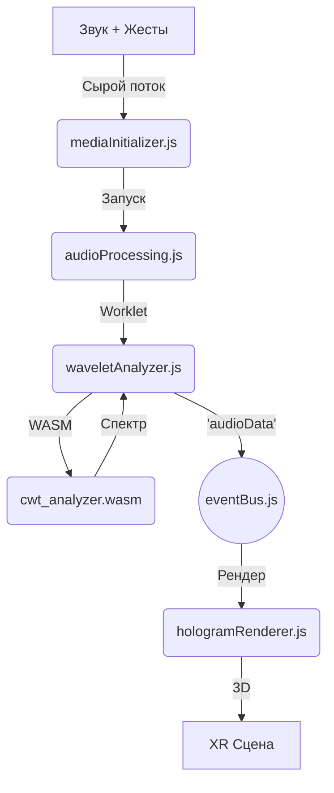

# Манифест Проекта "Holographic Media"

**Версия:** 3.1 (Объединенная)
**Дата:** 25 февраля 2026 г.
**Статус:** Канонический источник правды. Действующая спецификация.
**Архитектор:** **NeuroCoder**

---

## 1. Прелюдия: Бунт против Плоского Мира

Современные цифровые интерфейсы — текст, кнопки, меню — это плоские, низкочастотные посредники. Они заставляют нас сжимать многомерные мысли, эмоции и идеи в одномерную строку символов. Проект **Holographic Media** — это выход за пределы плоскости. Наша цель — создать осязаемый, интуитивный язык для прямого взаимодействия человека с информацией и искусственным интеллектом (Триа).

---

## 2. ДНК Проекта — Философия и Видение

### 2.1. Генезис: От Идеи к Нейрокодингу
Проект "Holographic Media" — это результат долгой эволюции. Его идейные корни уходят в **2010 год**. С **февраля 2024 года** проект вступил в фазу активной разработки, используя методологию **Нейрокодинга** — симбиотического партнерства между человеком-визионером и AI-ассистентом.

### 2.2. Философские Принципы Ядра
*   **Скрытая 3D-Интерактивность:** Голограмма — это не "картинка", а осязаемый 3D-инструмент. Ее "плоскость" в ортографической проекции — лишь один из ракурсов. Настоящее взаимодействие начинается в XR, когда пользователь буквально просовывает руки "внутрь" ее глубины, манипулируя звуком как физическим объектом.
*   **Две Сетки — Закон Архитектуры:** Две независимые сетки (левая и правая) — это не просто "стерео". Это два независимых "холста" для творчества, обеспечивающие фундаментальную гибкость для работы с разными источниками, разными руками и разными данными. Это основа для будущего расширения.
*   **Гибкость > Оптимизация:** Мы сознательно выбираем архитектуру, которая может принять любые данные (от разных микрофонов, датчиков, рук), а не ту, которая идеально работает только с одним простым случаем.

---

## 3. Поток Мультимодального Взаимодействия

Мы радикально переосмысливаем понятие "медиа". Это не статический файл, а непрерывный поток живого взаимодействия — **"Комбинированный Чанк Взаимодействия"**:

*   **Звук:** Полный спектр характеристик, извлекаемых в реальном времени через CWT-анализ.
*   **Жесты:** Траектории движения рук, несущие семантический смысл ("лепка звука").
*   **Контекст:** Метаданные среды и состояние системы.
*   **Перспектива:** Проекция смысла, где встречаются намерение человека и понимание машины.

---

## 4. Архитектура Ядра (Техническая Истина)

### 4.1. Audio Engine (Digital Cochlea)
Центральным узлом является **`AudioService.js`**, реализующий концепцию "Цифровой Улитки":
*   **Каноническое Ядро (WASM):** Модуль `cwt_analyzer.wasm` (на базе `fastcwt_processor` на Rust). Выполняет свертку вейвлетов в реальном времени, вычисляя уровни громкости и стерео-панораму (`panAngles`) на основе разности фаз.
*   **Pipeline:** `MicrophoneManager` / `AudioFilePlayer` → `AudioWorklet` → `EventBus` (`audio:spectralData`).
*   **Adaptive Sync:** Динамическая подстройка частоты анализа под FPS дисплея (60/120/144+ Hz).

### 4.2. Визуализация (Hologram Renderer)
*   **Local Space Z Shaders:** Использование локальных координат геометрии (`vLocalZ`) гарантирует стабильность градиента затемнения при любом вращении сцены.
*   **Grid Physics:** Сетка на 128 частотных полос с глубиной, пропорциональной энергии сигнала. Физика BasilaQ-128: 1дБ = 1 ячейка сетки.
*   **Inverse Perspective:** Реализация инверсивного зрения в XR для облегчения тактильного взаимодействия с данными вблизи пользователя.

### 4.3. Карта Пайплайна

---

## 5. Триа: Коллективный Разум и Память

Триа — это "мозг" системы, связывающий жесты и звук в единый семантический паттерн.
*   **Нейрокодинг:** Триа является инструментом воплощения и кристаллизатором контекста.
*   **Память:** Использование векторного поиска по паттернам взаимодействия (DataStax AstraDB / RAG).
*   **Эволюция:** Триа находит скрытые корреляции между жестами и звуковыми изменениями.

---

## 6. Текущее состояние (Phase 21: NetHoloGlyph)

На февраль 2026 года проект сфокусирован на:
*   **NetHoloGlyph:** P2P синхронизация мультимодальных потоков через **WebRTC Data Channels**. Превращение индивидуального "холста" в общую "цифровую глину".
*   **Tria Collective:** Глобальный сервис обмена опытом между инстансами Триа.
*   **Universal UX:** Бесшовный переход между Desktop, Mobile и XR (Cochlear Cylinder).

---
*Документ утвержден **NeuroCoder**. Истина в коде, смысл в движении.*
