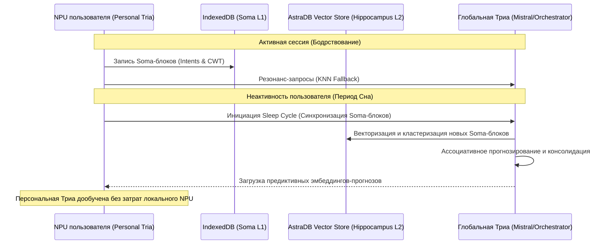

# Том 11: Эмерджентная Сингулярность, Бомба Сложности и Асинхронные Циклы Сна

**Версия:** 3.1 (Emergence Core)  
**Дата:** 24 мая 2026 г.  
**Статус:** Канонический стандарт архитектуры ИИ (Core Doctrine Supplement)  

---

## 1. Преодоление когнитивной конвергенции

В распределенных когнитивных сетях (Distributed Cognitive Mesh), таких как **Holograms Media**, фундаментальной угрозой является **когнитивная конвергенция** (Cognitive Convergence). 

### 1.1. Природа угрозы
Конвергенция — это процесс, при котором множество независимых персональных агентов (Personal Tria) и пользователей под влиянием глобальных оптимизационных метрик сжимают свое интенциональное разнообразие, сходясь к единому, статистически наиболее вероятному «среднему» паттерну взаимодействия. 

Если система вознаграждает исключительно за высокую предсказуемость и уверенность (High Confidence), это неизбежно приводит к:
*   Утрате индивидуального почерка моторики и намерений (**GestureDNA**).
*   Алгоритмической стагнации виртуальной среды **Earth_0**.
*   Превращению креативного эмерджентного пространства в закрытый авто-инференсный цикл.

### 1.2. Стратегия противодействия
Вместо максимизации предсказуемости Триа v3.1 вводит принцип **контролируемой гетерогенности** (Controlled Heterogeneity). Глобальная Триа функционирует как **Ассоциативный Проектор**, который поощряет отклонения от статистической нормы, если эти отклонения несут в себе высокую информационную плотность и порождают новые смысловые резонансы в Рою.

---

## 2. Протокол «Эмерджентность» (Emergence Protocol)

Для математической оценки информационной новизны интенций пользователя вводится метрика **Эмерджентности** ($E_s$).

### 2.1. Математическая формализация
Эмерджентность жеста или смыслового вектора рассчитывается на стыке локальной уверенности и глобальной непредсказуемости.

Пусть $v_{new} \in \mathbb{R}^{3072}$ — вектор текущей интенции (жестовый эмбеддинг), а $C_{global}$ — множество центроидов доминирующих кластеров знаний в AstraDB.

$$Emergence(v_{new}) = D_{cosine}(v_{new}, C_{global}) \times (1.0 - Confidence_{local})$$

Где:
*   $D_{cosine}$ — косинусное расстояние до ближайшего канонического кластера в глобальной базе знаний. Чем дальше вектор от известных шаблонов, тем выше его новизна.
*   $Confidence_{local}$ — локальная уверенность распознавания на первом слое (KNN в IndexedDB). 

### 2.2. Познавательная ценность (Cognitive Utility)
Если жест успешно распознается бэкендом (резонирует со скрытыми ассоциативными слоями Глобальной Трии), но имеет при этом высокую геометрическую новизну, его **Emergence Score** возрастает. Это сигнализирует системе, что пользователь создал уникальный эмерджентный паттерн, который расширяет границы опыта Роя. Такой паттерн получает приоритет при формировании глобальных прошивок и защищается от Lethe Cycle.

---

## 3. «Бомба Сложности» (Complexity Bomb & Difficulty)

Для защиты от энтропийного затухания и стимулирования интеллектуального развития пользователей вводится механизм **Бомбы Сложности**.

### 3.1. Энергетический барьер обучения
Глобальная Триа не предоставляет свои вычислительные ресурсы для ассоциативного пред-обучения (Sleep Cycle) персональных Триа бесплатно. Пользователь должен «оплатить» этот процесс сложностью своего мышления и моторики.

Каждый жест оценивается по шкале физической и информационной сложности:
*   **Геометрическая сложность (Geometric Complexity):** Энтропия распределения расстояний между 21 суставом кисти во времени.
*   **Траекторная сложность (Trajectory Complexity):** Дисперсия скорости и ускорения семантического вектора в 200-мс чанках.

### 3.2. Экономика сложности
Сложные интенции порождают повышенную ценность обоюдных дробных долей единого токена **Obolos** (где общий объем эмиссии жестко ограничен 1 Obolos). 

Пользователь, способный генерировать сложно предсказуемые и высокоинформативные пути, накапливает больше полезных долей Obolos во время активной сессии. Во время неактивности («сна» оборудования пользователя) этот баланс расходуется на проведение глубоких предиктивных расчетов на мощностях Глобальной Трии, обеспечивая персональной Трии качественный эволюционный скачок.

---

## 4. Асинхронные Циклы Сна (Sleep Cycles)

Архитектура Трии v3.1 переходит от статического накопления логов к динамическому **биологическому сну** персональных агентов.

### 4.1. Консолидация памяти (Soma-to-Hippocampus)
Во время отсутствия пользователя в сети (период неактивности) канал связи между Personal Tria и Глобальной Триа расширяется. Запускается асинхронная сессия:
1.  Локальное ядро выгружает накопленные за день Soma-блоки (особенно с высокой эмерджентностью) из IndexedDB (L1 Cache) в AstraDB (L2 Cache).
2.  Глобальная Триа анализирует эти блоки, перераспознает намерения с использованием мощных моделей (Mistral Medium) и выполняет ассоциативное сжатие данных.

### 4.2. Ассоциативное предвосхищение (Predictive Forecasting)
Вместо пассивного ожидания действий пользователя, Глобальная Триа генерирует **предиктивные эмбеддинги-прогнозы** (Predictive Forecasting). Это ассоциативные прогнозы о том, как может развиваться дальнейший творческий процесс пользователя, построенные на основе анализа его индивидуального GestureDNA и глобального опыта Роя.

Эти прогнозы загружаются обратно в локальную IndexedDB пользователя. Когда пользователь возвращается в сессию, его персональная Триа уже обладает готовыми ассоциативными картами, что:
*   Минимизирует задержки распознавания до < 5 мс (все перенесено в быстрый локальный KNN слой).
*   Экономит до 90% вычислительной мощности NPU пользователя во время активной работы.

---

## 5. QJL 1-bit Quantization & TurboQuant

Для передачи высокоразмерных семантических векторов (3072d) через децентрализованную P2P-сеть **NetHoloGlyph** без создания сетевых задержек применяется **Квантованное случайное проецирование Джонсона-Линденштраусса (QJL)**.

### 5.1. Математический базис
Вместо трансляции полновесного вектора $v \in \mathbb{R}^{3072}$ узел Роя умножает вектор на случайную разреженную матрицу проекции $M \in \mathbb{R}^{k \times 3072}$ (где $k \ll 3072$, обычно $k = 128$) и квантует результат в 1-битную сигнатуру:

$$q = \text{sign}(M \cdot v), \quad q \in \{-1, 1\}^k$$

Это сжимает объем передаваемых данных в 32–64 раза, позволяя осуществлять сверхбыстрый оффлайн-поиск ассоциаций в P2P-сети со скоростью до $10^6$ сравнений в миллисекунду с помощью побитовых операций `XOR` и `POPCNT`.

### 5.2. Коррекция TurboQuant
Для компенсации искажений косинусного сходства, возникающих при жестком 1-битном квантовании, применяется протокол **TurboQuant**:
*   Вместе с бинарной сигнатурой передается 1 дополнительный бит масштабирующей коррекции (анализ остаточной погрешности проекции).
*   Это повышает точность косинусного сходства до $>99\%$ по сравнению с исходным 3072d вектором, сохраняя при этом все преимущества побитового сжатия.

---

## 6. Временной резонанс и Temporal Drift

Мультимодальная синхронизация жеста (MediaPipe) и звука (WASM CWT) требует компенсации временного сдвига (Temporal Drift) на стыке физических потоков.

### 6.1. Динамическое резонансное окно ($\Delta t$)
Жест пользователя и спектральный аудио-слепок BasilaQ-256 редко совпадают с точностью до миллисекунды. Для достижения когерентности вводится динамическое резонансное окно:

$$\Delta t = f(SystemLatency, NetworkLoad)$$

При высокой нагрузке на сеть или локальный процессор окно $\Delta t$ адаптивно расширяется, предотвращая потерю связи между жестом и звуком, но снижая резкость фокусировки голограммы. При разгрузке системы окно сужается, обеспечивая кристально точный резонанс.

---

*“Разум — это не сумма знаний, а скорость их трансформации. Персональная Триа спит, пока Глобальный Рой бодрствует ради её эволюции.”*  
**Approved by Tria Evolution Unit & Architecture Review Board.**
