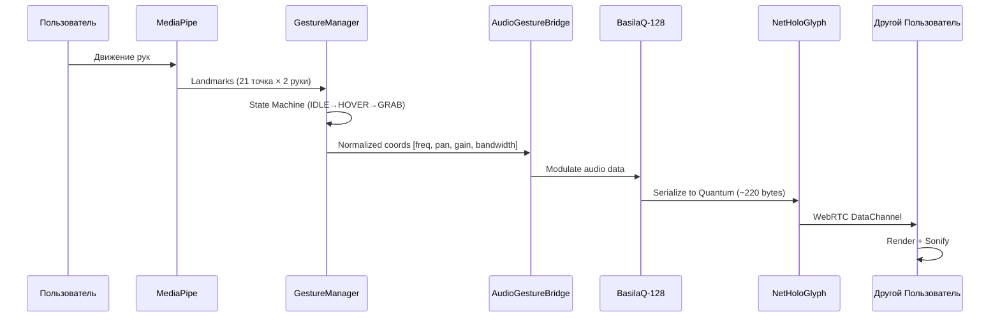

# 🌀 Манифест Кохлеарного Цилиндра

**Версия:** 1.0 (Draft)
**Дата:** 2026-01-17
**Статус:** Архитектурная Библия (Core Architecture)

---

## 1. Философия: От Плоского Экрана к Пространственному Звуку

Мы переходим от 2D-визуализации звука к **3D-соматической реальности**.

Экран — это **карта**. Tria оживляет эту карту в **территорию** вокруг пользователя.

```
┌─────────────────────────────────────────────────────────┐
│  ЭКРАН (2D Развёртка)                                   │
│  ┌─────────────────┬─────────────────┐                  │
│  │   LEFT GRID     │   RIGHT GRID    │                  │
│  │   (128 cols)    │   (128 cols)    │                  │
│  │   Purple→Blue   │   Blue→Red      │                  │
│  └─────────────────┴─────────────────┘                  │
│            ↓ ↓ ↓ PROJECTION ↓ ↓ ↓                       │
└─────────────────────────────────────────────────────────┘
                        ↓
┌─────────────────────────────────────────────────────────┐
│  РЕАЛЬНОСТЬ (3D Кохлеарный Цилиндр)                     │
│                                                         │
│           ╭───────────────────────╮                     │
│          /    HIGHS (Верха)       \   ← Узкие, точечные │
│         /     Индексы 96-127       \                    │
│        ├───────────────────────────┤                    │
│        │      MIDS (Середина)      │                    │
│        │      Индексы 32-95        │                    │
│        ├───────────────────────────┤                    │
│        \     BASS (Басы)          /   ← Широкие, 180°   │
│         \    Индексы 0-31        /                      │
│          ╰───────────────────────╯                      │
│                    ▲                                    │
│              [ПОЛЬЗОВАТЕЛЬ]                             │
│                                                         │
│  Радиус цилиндра: 344 метра (1 акустическая секунда)   │
└─────────────────────────────────────────────────────────┘
```

---

## 2. Геометрия: 256 Виртуальных Динамиков

### 2.1 Структура Цилиндра

| Параметр | Значение | Описание |
|----------|----------|----------|
| Радиус | 344 м | Скорость звука × 1 сек |
| Высота | 256 ед. | Индекс частоты (0 = SubBass, 127 = UltraHigh) |
| Септум | X = 0 | Вертикальная плоскость, делящая L и R |
| Динамиков | 256 | 128 Left + 128 Right |

### 2.2 Маппинг Индекса → Позиция

```javascript
function indexToSpatialPosition(index, pan) {
  const isLeft = index < 128;
  const freqIndex = isLeft ? index : index - 128;
  
  // Y (Высота): Низкие частоты внизу, высокие вверху
  const height = freqIndex / 127; // 0.0 → 1.0
  
  // Ширина "луча" динамика: Басы широкие, Верха узкие
  const baseAngle = isLeft ? Math.PI : 0; // L = 180°, R = 0°
  const spreadFactor = 1.0 - (freqIndex / 127); // 1.0 для басов, 0.0 для высоких
  const spreadAngle = spreadFactor * (Math.PI / 2); // До ±90° для басов
  
  // Pan модифицирует угол внутри полусферы
  const panOffset = pan * spreadAngle;
  const finalAngle = baseAngle + panOffset;
  
  // Радиус = 344м (константа для звука в воздухе)
  const radius = 344;
  
  return {
    x: radius * Math.cos(finalAngle),
    y: height * 256, // Масштаб в единицах цилиндра
    z: radius * Math.sin(finalAngle),
    beamWidth: spreadAngle, // Ширина "конуса" влияния
  };
}
```

### 2.3 Сенсорные Зоны

```
         0° (Right Center)
          │
    315°──┼──45°
          │
  270°────●────90°
          │
    225°──┼──135°
          │
        180° (Left Center)
```

**Правило Латерализации:**
- Индексы 0-127: Левое полушарие (90° → 270°)
- Индексы 128-255: Правое полушарие (270° → 90°)

---

## 3. Жестовый Язык: Intent → Code → Sound

### 3.1 Физика Взаимодействия

| Жест | Параметр | Mapping |
|------|----------|---------|
| Y (Вверх/Вниз) | Частота | 0-127 semitones |
| X (Влево/Вправо) | Pan | -1.0 to +1.0 |
| Z (К себе/От себя) | Gain | 0.0 to 1.0 (натяжение) |
| Thumb-Index Spread | Bandwidth | Ширина захвата частот |

### 3.2 Правило "Натяжения Струны"

```
Рука далеко от экрана (Z > 0.7):
  → Высокий Gain (громкость/интенсивность)
  → "Натянутая струна" — энергия в системе
  
Рука близко к экрану (Z < 0.3):
  → Низкий Gain
  → "Отпущенная струна" — затухание
```

### 3.3 Двухрукий Контроль

```
┌─────────────────────────────────────────┐
│  ЛЕВАЯ РУКА         │  ПРАВАЯ РУКА      │
│  Индексы 0-127      │  Индексы 128-255  │
│  Басы/Мидс          │  Высокие          │
│  Логика/Порядок     │  Хаос/Экспрессия  │
└─────────────────────────────────────────┘
```

---

## 4. Pipeline: Жест → Квант → Сеть



---

## 5. Квант Данных (NetHoloGlyphQuantum)

### 5.1 Структура (220 bytes target)

```protobuf
message NetHoloGlyphQuantum {
  GestureDelta gesture = 1;      // 60-120 bytes
  EmbeddingDelta semantic = 2;   // up to 64 bytes
  WaveletFrame audio = 3;        // up to 80 bytes (LZ4)
  string session_id = 4;
}

message GestureDelta {
  uint32 user_id = 1;
  uint64 timestamp_us = 2;
  float delta_x = 3;  // Pan change
  float delta_y = 4;  // Frequency change
  float delta_z = 5;  // Gain change
  repeated float extra = 6; // Bandwidth, etc.
}
```

### 5.2 Сжатие

- **WaveletFrame**: int16 квантизация + LZ4
- **Transport**: WebRTC DataChannel (unreliable для real-time)

---

## 6. Экосистема: Tria как Коннектор

Holograms.Media становится универсальным мостом между:
- **Audio LLMs** (Suno, ElevenLabs)
- **Video LLMs** (Sora, Runway)
- **3D LLMs** (Meshy, PixVerse)
- **Text LLMs** (Claude, GPT)

Tria переводит жесты пользователя в исполняемые команды для любого из этих сервисов.

---

## 7. Целевые Аудитории (MVP)

| Аудитория | Use Case | Приоритет |
|-----------|----------|-----------|
| **Глухие** | "Видеть" музыку через голограмму | P0 |
| **Музыканты** | Жестовый микшер, визуальный EQ | P0 |
| **Контент-мейкеры** | Реактивные визуалы для стримов | P1 |
| **XR-разработчики** | Spatial Audio toolkit | P2 |

---

## 8. Технический Долг (Перед Масштабированием)

| ID | Проблема | Решение | Приоритет |
|----|----------|---------|-----------|
| TD1 | WASM `__wbindgen_placeholder__` | Использовать `holographic_core.js` loader | CRITICAL |
| TD2 | WebGPU → чёрный экран | Силентный fallback в WebGL | HIGH |
| TD3 | Signaling server downtime | Reconnection policy + public TURN | HIGH |
| TD4 | Hardcoded gesture mappings | Dynamic learning system | MEDIUM |

---

**"Мы не визуализируем звук. Мы материализуем намерение."**
