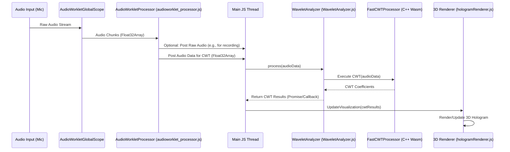

# NEOLANG WHITEPAPER 2.0: WHITEGHOST

## 1. Введение и Философия (Introduction and Philosophy)

Существующие методы коммуникации, преимущественно текстовые, демонстрируют свою возрастающую неспособность передавать полный спектр человеческого опыта, эмоций и намерений. Текст, по своей природе линейный и дискретный, значительно уступает богатству и многомерности живого человеческого взаимодействия. Современный цифровой мир развивается стремительными темпами, однако наша основная форма онлайн-общения — текст — всё больше отстает. Эта неэффективность приводит к недопониманию, потере контекста и общей фрустрации в цифровом взаимодействии. Мы стоим на пороге новой эры, где ограничения традиционного языка будут преодолены, и пришло время для парадигмального сдвига, который позволит нам коммуницировать на более интуитивном и многогранном уровне.

Встречайте "Технологию Трехмерной Аудиовизуализации" (ТТА) – ядро нашего проекта. Это не просто следующий шаг в развитии мультимедиа, а революционный подход к общению, стремящийся выйти за рамки существующих языковых барьеров. Мы предлагаем систему, где информация, звук, а в перспективе – эмоции и мысли, представляются в виде динамичных, интерактивных трехмерных моделей. ТТА призвана трансформировать абстрактные мысли, сложные концепции и мимолетные эмоции в динамичные, интерактивные трехмерные аудиовизуальные формы. Основываясь на идее преобразования звуковых волн (включая голос) в модифицируемые 3D-модели, эта технология пойдет дальше, интегрируя жестовые и, в перспективе, биометрические данные для формирования этих живых, дышащих информационных ландшафтов, способных передавать нюансы с невиданной ранее глубиной. Цель — создать более интуитивный, информационно насыщенный и потенциально универсальный способ коммуникации, способный обеспечить более глубокое и точное взаимопонимание между людьми.

Естественным продолжением этой технологии становится "Жестовая операционная система" (ЖОС). Взаимодействие с трехмерным аудиовизуальным пространством будет осуществляться через интуитивные жесты, возможно, в комбинации с голосовыми командами и другими модальностями ввода. Это не просто набор команд для управления системой, а новый, более органичный способ навигации, формирования и взаимодействия с информацией. ЖОС будет интуитивной средой, где приоритет отдан естественным формам ввода, обеспечивая бесшовное и органичное управление. Пользователь становится скульптором собственного информационного опыта, лепя и преобразуя данные движениями рук и тела.

Центральным элементом, оживляющим эту экосистему, является искусственный интеллект "Триа". Важно понимать, что Триа – это не внешний, заранее обученный ИИ, импортированный в систему. Это "жестовая лингвистическая модель", развивающаяся с нуля, неотъемлемая часть самой ткани новой коммуникационной парадигмы. Её обучение основано на принципах "медленного обучения" и "Absolute Zero Reasoning (AZR)", где она постигает мир через "чанки" – фрагменты жестов, аудиовизуальных образов и контекстуальных данных (фрагментов данных, объединяющих жест, аудио/видео контекст и биометрические сигналы). Триа предназначена для понимания, интерпретации и даже совместного с пользователем создания аудиовизуальных выражений в рамках нового языка, позволяя ей постоянно совершенствоваться. Триа выступает не просто как инструмент или набор алгоритмов, а как со-творец и фасилитатор в рамках "Технологии Трехмерной Аудиовизуализации", помогая пользователям ориентироваться и создавать в этом новом, богатом информационном мире. Триа — это центральный элемент нашей философии, нацеленной на создание революционной парадигмы коммуникации и взаимодействия человека с информацией и друг с другом.

## 2. Техническая Детализация и Архитектура (Technical Detailing and Architecture)

### 2.1. Анализ CWT (CWT Analysis)
Для анализа аудиосигналов в реальном времени, особенно в контексте их связи с жестами, Непрерывное Вейвлет-Преобразование (Continuous Wavelet Transform, CWT) предлагает значительные преимущества перед Быстрым Преобразованием Фурье (Fast Fourier Transform, FFT). В то время как FFT обеспечивает отличное разрешение по частоте для всего анализируемого блока данных, оно делает это за счет временной локализации – трудно точно определить, в какой момент времени внутри блока возникла та или иная частотная компонента. Это критический недостаток для нашего проекта, где важна точная синхронизация между звуковыми событиями и жестами.

CWT, напротив, предоставляет переменную разрешающую способность, позволяя одновременно получить хорошую временную локализацию для высокочастотных компонентов и хорошую частотную локализацию для низкочастотных. Это делает CWT идеальным инструментом для анализа транзиентных, быстро меняющихся характеристик звука, таких как резкие изменения тембра или интенсивности, которые могут быть маркерами для жестового ввода.

В качестве основного вейвлета для нашего проекта выбран вейвлет Морле. Этот выбор обусловлен несколькими причинами: вейвлеты Морле хорошо подходят для анализа сигналов, где важны как амплитудная, так и частотная модуляции. Их форма, являющаяся комплекснозначной экспонентой, модулированной Гауссовой функцией, близка к функциям Габора, которые считаются оптимальными для время-частотного анализа с точки зрения принципа неопределенности. Это позволяет нам эффективно выделять и анализировать локализованные во времени и частоте особенности аудиопотока, что является ключом к созданию отзывчивой жестовой системы.

### 2.2. Реализация на WebAssembly (WebAssembly Implementation)
Для достижения необходимой производительности при вычислении CWT в реальном времени, особенно в браузерной среде, мы используем WebAssembly (Wasm). Это позволяет нам выполнять ресурсоемкие вычисления с производительностью, близкой к нативной.

**C++ Модуль (`FastCWTProcessor`):**
Ядром нашей системы анализа является модуль, написанный на C++. Этот модуль, условно названный `FastCWTProcessor`, несет основную ответственность за выполнение CWT. Его задачи включают:
*   Получение сырых аудиоданных от основного приложения.
*   Эффективное вычисление Непрерывного Вейвлет-Преобразования с использованием выбранного вейвлета Морле.
*   Выдачу результатов преобразования – как правило, это будет структурированный формат (например, двумерный массив или более сложная структура), представляющий амплитуду сигнала в зависимости от времени и частоты.
Выбор C++ обусловлен его высочайшей производительностью и возможностями низкоуровневой оптимизации, что критически важно для минимизации задержек в интерактивной системе.

**JS-Обёртка (`WaveletAnalyzer`):**
Для интеграции C++ модуля в веб-приложение и обеспечения удобного взаимодействия с ним со стороны JavaScript, создается JS-обертка `WaveletAnalyzer`. Эта обертка выполняет следующие функции:
*   Загрузка и инициализация скомпилированного Wasm-модуля (`FastCWTProcessor.wasm`).
*   Предоставление чистого и простого API для JavaScript-части приложения (например, для `AudioWorklet`) для отправки аудиоданных в `FastCWTProcessor`.
*   Получение обработанных CWT-коэффициентов из Wasm-модуля обратно в JavaScript.
*   Управление памятью и преобразование данных (маршаллинг/анмаршаллинг) между JavaScript и WebAssembly, обеспечивая эффективный обмен информацией.

**Взаимодействие:**
`WaveletAnalyzer` выступает в роли моста. JavaScript-код, работающий в основном потоке или в `AudioWorklet`, передает блоки аудиоданных через `WaveletAnalyzer` в Wasm-модуль. `FastCWTProcessor` выполняет интенсивные вычисления CWT, и результаты возвращаются обратно в JavaScript через `WaveletAnalyzer` для дальнейшей обработки, визуализации или использования в системе распознавания жестов. Такой подход позволяет разгрузить основной поток JavaScript и обеспечить плавную работу пользовательского интерфейса даже при сложных вычислениях.

### 2.3. Пайплайн Данных (Data Pipeline)

Ниже представлена диаграмма последовательности, иллюстрирующая основной поток данных в системе, от захвата аудио до его визуализации после обработки.



Этот пайплайн обеспечивает эффективную обработку аудиоданных с использованием WebAssembly для ресурсоемких вычислений и AudioWorklet для работы с аудио в отдельном потоке, минимизируя нагрузку на основной поток и улучшая отзывчивость интерфейса.

### 2.4. Оптимизация (Optimization)

Для обеспечения плавной и отзывчивой работы системы в реальном времени, особенно при обработке и визуализации сложных данных CWT, будут применены следующие стратегии оптимизации:

*   **`InstancedMesh` для Рендеринга:**
    Результаты CWT часто представляют собой большое количество точек или графических элементов, которые необходимо отобразить (например, каждый коэффициент CWT может быть представлен как элемент в 3D пространстве). Для эффективной визуализации этих данных с использованием библиотеки Three.js будет применяться `THREE.InstancedMesh`. Эта техника позволяет отрисовать множество схожих объектов (инстансов) за один вызов отрисовки (draw call). Преимущество заключается в значительном снижении нагрузки на CPU и GPU по сравнению с индивидуальной отрисовкой каждого объекта. Это критически важно для поддержания высокой частоты кадров и плавной визуализации комплексных CWT-спектрограмм в реальном времени, формирующих основу "голографического" представления.

*   **`SharedArrayBuffer` для Передачи Данных:**
    Для минимизации задержек и накладных расходов при передаче аудиоданных между основным потоком JavaScript и `AudioWorkletProcessor`, а также потенциально для обмена данными с WebAssembly модулем (хотя прямой доступ к памяти Wasm часто является более предпочтительным для связки JS-Wasm), будет использоваться `SharedArrayBuffer` (SAB). SAB позволяет различным потокам (основному потоку, потокам ворклетов) одновременно получать доступ к одному и тому же блоку памяти без необходимости копирования данных, которое происходит при использовании стандартного `postMessage`. Это существенно снижает задержки и нагрузку на CPU. Важным аспектом при работе с SAB является необходимость применения механизмов синхронизации, таких как `Atomics` (например, `Atomics.wait()` и `Atomics.notify()`), для предотвращения состояний гонки и обеспечения когерентности данных при одновременном доступе из нескольких потоков.

*   **Кэширование Предварительно Вычисленных Вейвлетов:**
    Если реализация CWT включает свертку сигнала с масштабированными версиями материнского вейвлета (что является стандартным подходом), будет применена стратегия предварительного вычисления и кэширования этих масштабированных вейвлетов. Материнский вейвлет на различных требуемых масштабах будет вычислен один раз, на этапе инициализации приложения или `WaveletAnalyzer`, и сохранен в кэше. Преимущество этого подхода заключается в избежании избыточных вычислений одних и тех же масштабированных вейвлетов для каждого нового блока аудиоданных в процессе анализа в реальном времени. Это напрямую ускоряет сам процесс вычисления CWT, особенно если используется большое количество масштабов для детального частотно-временного разрешения.

Эти оптимизационные меры направлены на снижение вычислительной нагрузки, уменьшение задержек и обеспечение высокой производительности, необходимой для интерактивного взаимодействия с "Технологией Трехмерной Аудиовизуализации".

## 3. Архитектура AI "Триа" (AI "Tria" Architecture)

Искусственный интеллект "Триа" является сердцем системы NEOLANG, обеспечивая понимание, адаптацию и взаимодействие в рамках "Технологии Трехмерной Аудиовизуализации". Его архитектура основана на уникальных принципах обучения и распределенной системе специализированных ботов.

### 3.1. "Медленное обучение" и AZR ("Slow Learning" and AZR)

Фундаментом развития Триа служат два ключевых принципа: "Медленное обучение" и "Absolute Zero Reasoning".

*   **"Медленное обучение" (Slow Learning):**
    В отличие от традиционных подходов, требующих массивных, однократных сессий обучения на гигантских датасетах, "медленное обучение" представляет собой непрерывный, эволюционный процесс. Триа постоянно учится и дообучается на основе поступающего потока данных – так называемых "чанков". Каждый "чанк" – это небольшой фрагмент информации, включающий жестовые данные, аудиовизуальный контекст и результаты взаимодействия. Этот подход позволяет Триа постепенно адаптироваться к индивидуальным особенностям пользователя, улавливать нюансы развивающегося "жестового языка" и непрерывно совершенствовать свое понимание мира. Это похоже на то, как человек учится на протяжении всей жизни, постоянно впитывая новый опыт.

*   **"Absolute Zero Reasoning" (AZR):**
    AZR – это основополагающий принцип построения знаний Триа. Он означает, что Триа стремится формировать свое понимание, исходя из фундаментальных принципов и непосредственно полученного опыта (анализа "чанков"), минимизируя зависимость от предварительно загруженных, обширных баз знаний или скрытых предубеждений, свойственных многим современным LLM. Хотя для начальной загрузки (bootstrapping) могут использоваться некоторые базовые концепции, основной механизм рассуждений и приобретения знаний заключается в анализе взаимосвязей внутри "чанков" – как конкретный жест соотносится с определенным звуковым образом, визуальным ответом системы или последующими действиями пользователя. Такой подход позволяет Триа развивать уникальную, глубоко специализированную модель понимания, идеально настроенную на специфический домен аудиовизуальной жестовой коммуникации NEOLANG.

*   **Сбор и Использование Данных:**
    Данные для обучения Триа собираются в виде анонимизированных "чанков". Каждый "чанк" может включать:
    *   **Жестовые данные:** Координаты ключевых точек скелета (skeletal tracking), векторы движения, ориентация рук и пальцев.
    *   **Аудиоконтекст:** CWT-коэффициенты обработанного звука, характеристики просодии (интонация, ритм), распознанные звуковые события.
    *   **Видео/Средовой контекст (опционально):** Краткие видеофрагменты или данные об окружении, если это релевантно для интерпретации жеста.
    *   **Обратная связь системы/пользователя:** Реакция системы на жест, подтверждение или коррекция со стороны пользователя.
    Ключевым аспектом является строгая анонимизация всех собираемых данных для обеспечения приватности пользователей. Эти "чанки" затем используются для непрерывного дообучения (fine-tuning) внутренних моделей Триа, реализуя на практике концепцию "медленного обучения".

### 3.2. Экосистема Ботов (Bot Ecosystem)

Операционные способности Триа реализуются через распределенную систему специализированных программных агентов – ботов. Каждый бот отвечает за определенный аспект обработки информации или взаимодействия, работая синергично для обеспечения общей функциональности.

*   **Общая Роль:** Экосистема ботов представляет собой модульную, распределенную структуру, которая в совокупности и составляет операционное ядро Триа. Это позволяет гибко развивать и масштабировать систему, добавляя или обновляя отдельных ботов по мере необходимости.

*   **`GestureBot` (Жестовый Бот):**
    *   **Роль:** Отвечает за анализ и интерпретацию жестовых данных в реальном времени.
    *   **Функции:** Распознает паттерны жестов, классифицирует их и транслирует в осмысленные команды или элементы "жестового языка" NEOLANG. Тесно взаимодействует с результатами CWT-анализа звука для получения полного контекста (например, жест руки, сопровождаемый определенной интонацией голоса). Захватывает и обрабатывает сырые данные от систем трекинга рук (например, MediaPipe, Fingerpose), выполняет фильтрацию, нормализацию, экстракцию признаков и преобразует данные в структурированный формат для Триа.

*   **`MemoryBot` (Бот Памяти):**
    *   **Роль:** Управляет кратковременной и долговременной памятью Триа.
    *   **Функции:** Хранит и извлекает обработанные "чанки", выученные ассоциации (например, "этот жест обычно означает X в контексте Y"), пользовательские предпочтения (в анонимизированном виде) и историю взаимодействий. Обеспечивает связывание новой информации с существующими знаниями, формируя семантическую сеть понимания Триа, и предоставляет быстрый поиск релевантной информации другим ботам.

*   **`LearningBot` (Обучающий Бот):**
    *   **Роль:** Реализует процессы "медленного обучения" и AZR.
    *   **Функции:** Получает на вход обработанные "чанки" от других ботов (например, `GestureBot` и `AudioAnalysisBot`, который неявно присутствует в CWT-обработке), а также данные из `MemoryBot`. Анализирует эти чанки, выявляет паттерны и корреляции, обновляет внутренние модели Триа, генерирует гипотезы о значениях новых жестов и обеспечивает постепенное развитие и совершенствование понимания Триа.

*   **`CoordinationService` (Координационная Служба):**
    *   **Роль:** Выполняет функции центрального координатора или оркестратора для всей экосистемы ботов.
    *   **Функции:** Управляет потоками данных и последовательностью выполнения задач между различными ботами (`GestureBot`, `LearningBot`, `MemoryBot`). Обеспечивает слаженную и когерентную работу всей системы, разрешает возможные конфликты или неоднозначности в интерпретации данных от разных ботов. Передает результаты работы Триа во внешние системы (например, пользовательский интерфейс). Можно рассматривать `CoordinationService` как своего рода "нервный центр" Триа, интегрирующий специализированные функции в единое целое и принимающий решения о дальнейших действиях системы.

Эта архитектура позволяет Триа быть гибкой, адаптивной и постоянно развивающейся системой, способной к глубокому пониманию нового языка трехмерной аудиовизуальной коммуникации.

```mermaid
graph TD
    UserInput[User Input / Data Context <br> (Жесты, Аудио, Видео)] --> GB(GestureBot);
    UserInput --> AC(AudioAnalysis <br> CWT, Prosody);
    AC --> CS{CoordinationService};
    GB --> CS;

    CS --> MB[MemoryBot <br> (Хранение/Извлечение <br> Чанков, Паттернов)];
    CS --> LB[LearningBot <br> (Медленное обучение, AZR)];

    MB <--> CS;
    LB --> CS; <em>Обновленные модели/знания</em>

    subgraph "Tria Core Logic via CoordinationService"
        direction LR
        CS -->|Запрос данных| MB;
        CS -->|Передача чанков для обучения| LB;
        CS -->|Запрос интерпретации| GB;
        CS -->|Запрос аудио анализа| AC;
        GB -->|Результаты анализа жестов| CS;
        AC -->|Результаты анализа аудио| CS;
        MB -->|Данные из памяти| CS;
        LB -->|Обновленные модели/понимание| CS;
    end

    CS --> OutputAction[Tria's Output / System Action <br> (Визуализация, Ответы)];
```

### 3.3. Интеграция LangChain/LangGraph (LangChain/LangGraph Integration)

Для построения, управления и оркестрации сложной экосистемы ботов, составляющих ИИ "Триа", мы планируем использовать фреймворки LangChain и, в частности, LangGraph. Эти инструменты выступят в роли своего рода "нервной системы" или соединительной ткани, обеспечивающей слаженную работу всех компонентов Триа.

*   **Роль как "Нервной Системы":**
    LangChain/LangGraph предоставляют высокоуровневые абстракции и инструменты для создания цепочек вызовов (chains) и графов (graphs) из различных вычислительных блоков. В нашем случае, каждый бот (`GestureBot`, `MemoryBot`, `LearningBot`) или даже отдельные их функции могут быть представлены как узлы в такой структуре. Это позволяет декларативно описывать логику взаимодействия между ними, управление потоками данных и принятие решений.

*   **Построение Сложных Потоков (Complex Flows):**
    С помощью LangChain/LangGraph можно легко конструировать сложные последовательности операций. Например, интерпретация пользовательского ввода может включать:
    1.  Параллельный анализ жеста (`GestureBot`) и аудио (`AudioAnalysisBot`/CWT).
    2.  Передачу результатов в `CoordinationService`.
    3.  Запрос релевантной информации из `MemoryBot` для контекстуализации.
    4.  Принятие решения о реакции системы или необходимости дополнительного обучения (`LearningBot`).
    Эти фреймворки упрощают интеграцию различных источников данных, вызовов моделей (даже если некоторые суб-задачи внутри ботов будут использовать специализированные LLM или другие ML-модели) и пользовательских функций.

*   **Управление Состоянием и Циклические Взаимодействия (State Management & Cyclical Interactions):**
    LangGraph особенно полезен для создания циклических и управляемых состоянием взаимодействий. Это критически важно для реализации продвинутых сценариев, таких как:
    *   **Уточняющие диалоги:** Если `GestureBot` не уверен в интерпретации жеста, LangGraph может управлять потоком, который запрашивает у пользователя уточнение, сохраняет эту информацию через `MemoryBot` и инициирует дообучение через `LearningBot`.
    *   **Адаптивные циклы обучения:** `LearningBot` может инициировать запрос на сбор специфических данных, если обнаруживает пробелы в своем понимании, создавая петлю обратной связи.
    *   **Обработка ошибок и устойчивость:** Сложные графы могут включать механизмы для отлова ошибок в одном из ботов и запуска альтернативных путей обработки.

*   **Модульность и Масштабируемость (Modularity and Scalability):**
    Использование LangChain/LangGraph способствует созданию модульной архитектуры. Каждый бот может быть разработан и протестирован как относительно независимый компонент. Изменение логики взаимодействия или добавление нового бота (например, `EmotionBot` для анализа эмоциональной окраски) сводится к модификации или расширению графа/цепочки, что значительно упрощает эволюцию и масштабирование Триа. Это позволяет нам начать с базовой архитектуры и постепенно наращивать ее сложность и функциональность.

Таким образом, LangChain/LangGraph предоставляют инженерный фундамент для реализации сложной, многокомпонентной и развивающейся архитектуры ИИ "Триа", позволяя эффективно управлять взаимодействием между ее частями и обеспечивать гибкость для будущего роста.

## 4. Пользовательский Опыт (UX/UI) (User Experience (UX/UI))

Освоение новой парадигмы взаимодействия требует особого внимания к пользовательскому опыту. Наша цель – сделать погружение в мир "Технологии Трехмерной Аудиовизуализации" интуитивным, комфортным и безопасным.

### 4.1. Интерактивный Тур (Interactive Tour)

Для плавного введения пользователей в уникальный интерфейс и способы взаимодействия с системой NEOLANG будет разработан интерактивный обучающий тур.

*   **Цель (Purpose):** Основная задача тура – провести пользователя через ключевые концепции "Технологии Трехмерной Аудиовизуализации" и "Жестовой операционной системы". Тур поможет освоить базовые жесты, понять принципы аудиовизуальной обратной связи и научиться эффективно использовать возможности системы с первых минут.

*   **Динамическое Руководство на Базе LLM (Powered by Mistral Small):**
    Повествование и подсказки в рамках интерактивного тура будут генерироваться или адаптироваться с помощью компактной и эффективной языковой модели, такой как Mistral Small (или аналогичной). Это позволит туру быть не просто статичным набором инструкций, а отзывчивой системой, способной реагировать на действия пользователя, предлагать подсказки в зависимости от контекста или даже отвечать на простые вопросы пользователя о текущем шаге обучения.

*   **Механика Реализации (Mechanics):**
    *   **Голосовое Сопровождение (Voiceovers):** Для повышения вовлеченности и доступности будет активно использоваться `Web Speech API`, в частности `SpeechSynthesis` (синтез речи). Голосовые инструкции будут сопровождать пользователя на каждом этапе тура.
    *   **Визуальное Акцентирование (Element Highlighting):** По мере продвижения по туру, релевантные элементы пользовательского интерфейса, активные зоны в 3D-визуализации или примеры жестов будут подсвечиваться или иным образом визуально акцентироваться, чтобы направить внимание пользователя.
    *   **Пошаговое Руководство (Step-by-Step Guidance):** Тур будет методично знакомить с основными функциями: как инициировать жест, как интерпретировать аудиовизуальную обратную связь от системы, как осуществлять базовую навигацию и манипулирование объектами в трехмерном пространстве.
    *   **Интерактивные Задания (Interactive Prompts):** Пользователям будет предложено попробовать выполнить простые жесты или взаимодействия непосредственно во время тура. Система предоставит обратную связь об успешности выполнения, помогая закрепить полученные навыки.

### 4.2. PWA и Локальное Хранение (PWA and Local Storage)

Для обеспечения максимального удобства доступа и расширения функциональности, приложение NEOLANG будет предлагаться в формате Прогрессивного Веб-Приложения (PWA) с использованием локального хранения данных.

*   **Прогрессивное Веб-Приложение (PWA):**
    Мы стремимся предоставить пользователям опыт, максимально приближенный к нативным приложениям.
    *   **Преимущества (Benefits):** PWA позволяет установить приложение прямо из браузера ("Добавить на главный экран"), обеспечивает возможность работы в офлайн-режиме (как минимум, для основного интерфейса и кэшированных данных), а также быструю загрузку и обновления без участия магазинов приложений.

*   **Приглашение к Установке PWA (PWA Installation Prompt):**
    Пользователи будут получать ненавязчивое предложение установить PWA после нескольких успешных сессий взаимодействия с приложением или через ясно видимый баннер/опцию в интерфейсе, чтобы не прерывать первоначальное знакомство.

*   **Локальное Хранение Данных (Local Data Storage):**
    Определенные данные будут храниться локально на устройстве пользователя для улучшения производительности и персонализации. Для этого будут использоваться современные браузерные механизмы, такие как `IndexedDB`.
    *   **Примеры данных:** Пользовательские настройки интерфейса, кэшированные "чанки" (для ускорения доступа или частичной офлайн-функциональности), локально изученные или адаптированные паттерны жестов (если пользователь предпочитает локальную персонализацию перед возможной передачей анонимизированных данных для глобального обучения Триа).

*   **Механизм Согласия (Consent Mechanism):**
    Перед активацией значительного объема локального хранения данных или предложением установки PWA пользователь должен будет дать явное согласие. Процесс получения согласия будет включать четкое и понятное объяснение:
    *   Какие данные будут храниться.
    *   С какой целью они хранятся.
    *   Как они используются системой.
    *   Как пользователь может управлять этими данными или удалить их.

*   **Юридические Аспекты и Отказ от Ответственности (Legal Disclaimers):**
    *   **Открытый Исходный Код:** Будет подчеркнуто, что проект NEOLANG является разработкой с открытым исходным кодом.
    *   **Использование "Как Есть":** Пользователи будут уведомлены, что они используют программное обеспечение "на свой страх и риск", особенно в отношении экспериментальных функций и локального хранения данных. Это будет частью диалога получения согласия и/или условий предоставления услуг.
    *   **Политика Конфиденциальности:** Будет предоставлена ссылка на полную Политику Конфиденциальности (детализированную в соответствующем разделе Белой Книги), описывающую сбор, использование и защиту данных.

Мы стремимся к полной прозрачности в вопросах сбора и использования данных, предоставляя пользователю контроль над своей информацией.

## 5. Безопасность и Приватность (Security and Privacy)

Обеспечение безопасности данных и защита приватности пользователей являются краеугольными камнями проекта NEOLANG. Мы подходим к этим вопросам с максимальной ответственностью, интегрируя принципы приватности непосредственно в архитектуру системы.

*   **Ключевой Принцип: Приватность по Умолчанию (Privacy by Design):**
    Приватность пользователя – не дополнительная функция, а фундаментальный аспект, учитываемый на всех этапах проектирования и разработки системы. Мы стремимся минимизировать сбор и обработку персонально идентифицируемой информации. Все данные, где это возможно, подвергаются анонимизации или агрегации по умолчанию.

*   **Локальная Обработка Чувствительных Данных:**
    Наиболее чувствительные данные – сырые аудио- и видеопотоки с микрофона и камеры пользователя – обрабатываются преимущественно **локально, на устройстве пользователя**, или, как мы это называем, **"на лету"**.
    *   Это означает, что ключевые процессы, такие как анализ CWT аудиосигнала и первичное распознавание жестов (например, с использованием MediaPipe/Fingerpose), происходят непосредственно в браузере или PWA на стороне клиента.
    *   Основная цель такого подхода – минимизировать или полностью исключить передачу необработанных, идентифицируемых аудиовизуальных данных на какие-либо удаленные серверы. Данные остаются под контролем пользователя.

*   **Данные, Отправляемые на Сервер (для Обучения ИИ "Триа"):**
    Для обучения и совершенствования глобальной модели ИИ "Триа", а также для обеспечения некоторых сетевых функций, на сервер может отправляться строго ограниченный и анонимизированный набор данных. Основной и единственной целью сбора этих данных является совершенствование AI "Триа", улучшение точности распознавания нового языка и общего пользовательского опыта. Данные не будут использоваться для коммерческого профилирования пользователей, таргетированной рекламы или других целей, не связанных напрямую с развитием платформы Neolang. К таким данным относятся исключительно:
    *   **Анонимизированные Метаданные:** Это могут быть временные метки, общие категории взаимодействий (например, "построение объекта", "коммуникационный жест"), информация о производительности локальной обработки. Эти данные не содержат прямых идентификаторов пользователя.
    *   **Анонимизированные Векторы Жестов:** После локальной обработки и распознавания, на сервер могут отправляться числовые представления жестов (например, координаты суставов скелета, нормализованные траектории движения). Эти векторы необходимы для обучения Триа новым жестам и паттернам, но они отвязаны от личности пользователя и не содержат информации, позволяющей визуально реконструировать руки пользователя или окружающую обстановку.
    *   **Контекстуальные Признаки (Анонимизированные):** Если для корреляции с жестами и улучшения понимания Триа требуются аудио признаки (например, доминирующие частоты из CWT, просодические характеристики в обезличенном виде, векторы коэффициентов CWT), они также должны быть анонимизированы и агрегированы таким образом, чтобы не представлять собой фрагменты сырого аудио и не позволять идентифицировать голос или содержание речи. В исключительных, строго оговоренных случаях, для калибровки специфических звуко-жестовых команд, могут включаться очень короткие аудиофрагменты с дополнительными мерами по удалению идентифицирующей информации.

*   **Отсутствие Серверного Хранения Сырых Потоков:**
    Мы категорически заявляем, что **сырые (необработанные) аудио- и видеопотоки с устройств пользователей не сохраняются и не логируются на серверах проекта NEOLANG.**

*   **Контроль Пользователя и Прозрачность:**
    *   Как уже упоминалось в разделе UX/UI (4.2.2 "Согласие на Локальное Хранение Данных и Юридические Аспекты"), пользователи будут иметь полный контроль над тем, какими данными (даже анонимизированными) они готовы делиться для улучшения глобальной модели Триа. Это будет реализовано через детализированные механизмы получения согласия.
    *   Система будет максимально прозрачна в отношении того, какие данные собираются, как они обрабатываются и с какой целью используются. Соответствующая информация будет доступна в Политике Конфиденциальности и в интерфейсе приложения.

*   **Общие Меры Безопасности Данных:**
    Для тех анонимизированных и агрегированных данных, которые все же достигают серверной части (например, для обучения Триа или синхронизации пользовательских предпочтений между устройствами по желанию пользователя), будут применяться стандартные отраслевые практики безопасности:
    *   Защищенная передача данных (HTTPS/TLS).
    *   Меры по защите от несанкционированного доступа к базам данных.
    *   Регулярные аудиты безопасности серверной инфраструктуры.

*   **Открытый Исходный Код и Аудит Сообщества:**
    Напоминаем, что NEOLANG – проект с открытым исходным кодом. Это означает, что любой желающий может изучить код, включая механизмы обработки и передачи данных. Мы приветствуем аудит со стороны сообщества как дополнительный фактор, способствующий проверке наших заявлений о приватности и безопасности, а также выявлению потенциальных уязвимостей.

Наша цель – построить доверительные отношения с пользователями, основанные на уважении к их приватности и прозрачности наших процессов.

## 6. Экономика Проекта ("HoloGraph") (Project Economy ("HoloGraph"))

Экономическая модель проекта NEOLANG призвана стимулировать развитие и совершенствование искусственного интеллекта "Триа" через вовлечение сообщества. Основываясь на некоторых визионерских концепциях, изложенных в "NEOLANG WHITEPAPER 1.1" (таких как INFOCOIN и идея Гипермозга), текущая экономическая модель фокусируется на более конкретном и непосредственном применении токеномики для поддержки роста экосистемы. Встречайте токен "HoloGraph" (HG).

*   **Отход от Ранних Концепций к "HoloGraph":**
    Первоначальные идеи, такие как INFOCOIN и глобальная экономика внимания, были амбициозным видением будущего. В рамках текущего этапа развития проекта WHITEGHOST, мы представляем токен "HoloGraph" (HG) как более сфокусированный инструмент, предназначенный для стимулирования ключевой активности – обогащения обучающих данных для ИИ "Триа".

*   **Ключевая Концепция: "Интеллектуальный Майнинг" (Intellectual Mining):**
    "Интеллектуальный майнинг" – это основной механизм, посредством которого пользователи могут зарабатывать токены HoloGraph. В контексте Neolang 2.0, это процесс, где пользователи напрямую способствуют росту и совершенствованию AI "Триа", базируясь на принципе **"Proof-of-Contribution" (доказательство вклада)** или **"Proof-of-Value" (доказательство ценности)**. Суть его заключается в следующем: пользователи получают вознаграждение за предоставление высококачественных и ценных "чанков" (chunks) данных, которые напрямую способствуют обучению, адаптации и эволюции ИИ "Триа".
    Эти "чанки" представляют собой анонимизированные (согласно разделу "Безопасность и Приватность") данные об их жестовых взаимодействиях с системой, сопутствующий аудиовизуальный контекст (обработанный локально, как детализировано в разделе 5.2) и, возможно, другие релевантные параметры, которые помогают Триа лучше понимать и генерировать "жестовый язык". Чем качественнее и разнообразнее эти данные, тем быстрее и эффективнее Триа сможет осваивать новый аудиовизуальный язык.

*   **Ценность "Чанков" (Value of "Chunks"):**
    Не все "чанки" одинаково полезны. Ценность "чанка" для системы и, соответственно, размер вознаграждения (в токенах HG), может определяться несколькими факторами:
    *   **Четкость и Однозначность (Clarity and Uniqueness):** Насколько хорошо определен и недвусмысленен жест. Легко ли его отличить от других жестов.
    *   **Контекстуальное Богатство (Contextual Richness):** Наличие четкого и релевантного аудиовизуального или средового контекста, который помогает Триа понять значение жеста в конкретной ситуации.
    *   **Новизна и Сложность (Novelty and Complexity):** Предоставление новых, ранее неизвестных системе жестов, или использование известных жестов в новых, сложных комбинациях или контекстах, расширяющих "словарный запас" и понимание Триа.
    *   **Подтверждение Сообществом (Community Validation - возможная будущая функция):** В перспективе, может быть внедрен механизм, где активные члены сообщества (возможно, также стимулируемые токенами HG) анонимно участвуют в валидации и оценке качества "чанков", помогая отсеивать шум и выделять наиболее ценные данные. Дифференцированное вознаграждение может применяться к "чанкам", вносящим значительный вклад.

*   **Назначение Токенов HoloGraph (Purpose of HoloGraph Tokens):**
    Токены HoloGraph (HGT) служат нескольким ключевым целям в экосистеме NEOLANG:
    *   **Стимулирование (Incentivization):** Основная цель – мотивировать пользователей активно участвовать в жизни проекта, используя систему и предоставляя разнообразные, высококачественные данные, необходимые для непрерывного обучения и совершенствования ИИ "Триа". Пользователи, чьи "чанки" принимаются системой для обучения AI, будут вознаграждены токенами HGT.
    *   **Управление (Governance - потенциальное будущее применение):** В долгосрочной перспективе, по мере децентрализации проекта, токены HoloGraph могут получить функции управления (governance tokens). Держатели токенов смогут участвовать в принятии решений, касающихся развития платформы, приоритетов разработки Триа или других ключевых аспектов экосистемы. Это перекликается с DAO-подобными концепциями из оригинальной Белой Книги, но выносится на будущие этапы.
    *   **Доступ к Расширенным Возможностям (Access to Premium Features - потенциальное будущее применение):** Возможно, по мере созревания экосистемы, токены HG можно будет использовать для получения доступа к продвинутым функциям, эксклюзивному контенту или специализированным инструментам в рамках платформы NEOLANG. В долгосрочной перспективе могут быть рассмотрены механизмы стейкинга или интеграция с DeFi, а также листинг на биржах при достижении проектом зрелости.

*   **Отличие от Изначальной Экономической Модели:**
    Важно подчеркнуть, что текущая модель "интеллектуального майнинга" отличается от некоторых первоначальных идей, где предполагалась оплата за время коммуникации между пользователями. В данной итерации фокус смещен на вознаграждение за вклад в развитие общего блага – искусственного интеллекта "Триа". "Интеллектуальный майнинг" здесь – это не столько о "продолжительности мысли", сколько о "качестве и релевантности данных для обучения ИИ".

*   **Этические Аспекты (Ethical Considerations):**
    Мы осознаем важность построения справедливой системы, которая не будет стимулировать создание низкокачественных или "мусорных" данных ради получения токенов. Механизмы оценки качества "чанков" (включая возможную валидацию сообществом) и алгоритмы распределения вознаграждений будут разрабатываться с учетом минимизации таких рисков. Приоритетом является получение действительно ценных данных, способствующих реальному улучшению ИИ "Триа".

Экономика "HoloGraph" призвана создать симбиотическую связь между пользователями и развитием ИИ, где вклад каждого участника ценится и вознаграждается, ведя к созданию более умной и отзывчивой системы для всех. Эта модель значительно упрощена по сравнению с первоначальными идеями, фокусируясь на прямой и понятной связи: **вклад ценных данных = вознаграждение**.

## 7. Дорожная Карта (Roadmap)
Развитие проекта Neolang планируется поэтапно, обеспечивая постепенное наращивание функциональности, обучение AI "Триа" и расширение пользовательского опыта.

### 7.1. Краткосрочные Цели (ближайшие 3-6 месяцев) - Фаза "Фундамент"
На этом этапе закладываются основы технологического стека и ключевых компонентов системы.

*   **Core Technology (CWT, WASM, Visualization):**
    *   **`FastCWTProcessor` (Alpha):** Разработка и тестирование альфа-версии C++ модуля `FastCWTProcessor`, скомпилированного в WebAssembly. Интеграция с `AudioWorklet` для анализа аудиопотока в реальном времени.
    *   **Базовый Рендеринг Голограммы:** Создание `HologramRenderer` с использованием `THREE.InstancedMesh` для отображения простой 3D голограммы, динамически изменяющейся на основе данных от CWT.
    *   **Оптимизация Передачи Данных:** Реализация `SharedArrayBuffer` для эффективной и быстрой передачи данных (результатов CWT) между `AudioWorklet` и основным потоком JavaScript, минимизируя задержки.
*   **AI "Триа" (Сбор "Чанков", Разработка Ботов):**
    *   **`GestureBot` (Начальная Версия):** Разработка первой версии `GestureBot`, способного захватывать сырые данные о жестах (например, от MediaPipe) и выполнять их базовую обработку (например, выделение ключевых точек).
    *   **Структура "Чанка":** Проектирование и начальная реализация формата данных для "чанков", включая анонимизированные векторы жестов и извлеченные аудио-характеристики.
    *   **Инфраструктура для Сбора "Чанков":** Настройка базовой серверной инфраструктуры и API для безопасного приема и хранения анонимизированных "чанков" данных от пользователей (с их согласия).
*   **UX/UI (Интерактивный Тур, PWA):**
    *   **Прототип PWA:** Разработка функционального прототипа Прогрессивного Веб-Приложения (PWA) с возможностью аудиоввода, базовой визуализацией и первичной структурой интерфейса.
    *   **Концепция Интерактивного Тура:** Детальная проработка концепции и сценариев для интерактивного обучающего тура, определение ключевых точек взаимодействия.
*   **HoloGraph Economy (Токеномика):**
    *   **Исследование Токеномики:** Глубокое исследование и определение основных параметров токеномики для будущих токенов "HoloGraph", включая модели эмиссии, распределения и стимулирования.
*   **Community & Testing:**
    *   **Запуск Сайта Проекта:** Создание и запуск предварительного веб-сайта или лендинг-пейдж проекта с доступом к WHITEGHOST Whitepaper и основной информацией.
    *   **Внутреннее Тестирование:** Начало интенсивного внутреннего тестирования основного пайплайна аудиовизуализации (захват аудио, CWT-анализ, рендеринг).

### 7.2. Среднесрочные Цели (6-12 месяцев) - Фаза "Эволюция Триа и UX"
Этот этап фокусируется на развитии интеллекта "Триа", улучшении пользовательского опыта и запуске первых программ для сообщества.

*   **Core Technology (CWT, WASM, Visualization):**
    *   **Стабильная Бета-Версия Визуализации:** Выпуск бета-версии системы аудиовизуализации с повышенной стабильностью, производительностью и качеством графики.
    *   **Интеграция Базовых Жестовых Команд:** Реализация управления параметрами визуализации (например, цвет, масштаб, форма) с помощью базовых жестов, как описано в `docs/01_ARCHITECTURE/audio_visualization_architecture.md`.
*   **AI "Триа" (Сбор "Чанков", Разработка Ботов, Обучение):**
    *   **Функциональный `MemoryBot`:** Разработка и внедрение `MemoryBot`, способного эффективно сохранять, индексировать и извлекать анонимизированные "чанки" и сопутствующие контекстуальные данные.
    *   **Первая Версия `LearningBot`:** Создание начальной версии `LearningBot`, реализующей принципы "медленного обучения" для анализа собранных "чанков" (например, распознавание простых паттернов в жестах и их связь с аудио-характеристиками).
    *   **Прототип `CoordinationService`:** Разработка прототипа `CoordinationService` с использованием LangChain/LangGraph для базовой оркестрации взаимодействия между `GestureBot`, `MemoryBot` и `LearningBot`.
    *   **Запуск Программы Сбора Данных (Альфа):** Открытие альфа-программы для ограниченного числа пользователей по добровольному предоставлению "чанков" для обучения Триа.
*   **UX/UI (Интерактивный Тур, PWA):**
    *   **Реализация Интерактивного Тура:** Внедрение интерактивного тура на базе Mistral Small (или аналогичной LLM), с озвучкой через `Web Speech API` и динамической подсветкой элементов интерфейса.
    *   **Полноценное PWA:** Обеспечение полной функциональности PWA, включая надежные механизмы предложения установки приложения и расширенные возможности работы в оффлайн-режиме (кэширование ресурсов).
    *   **Механизм Согласия:** Внедрение прозрачного механизма получения согласия пользователя на локальное хранение данных и участие в программе сбора "чанков".
*   **HoloGraph Economy (Токеномика):**
    *   **Разработка Смарт-Контракта:** Создание смарт-контракта для токена "HoloGraph" (HGT) и разработка начальных механизмов распределения вознаграждений для участников программы сбора "чанков".
*   **Community & Testing:**
    *   **Закрытая Бета-Программа:** Запуск закрытой бета-программы для ранних последователей с целью тестирования функциональности, сбора обратной связи и активного вклада "чанков".
    *   **Создание Каналов Сообщества:** Организация официальных каналов для общения сообщества (например, Discord-сервер, форум).
    *   **CI/CD и `verify_imports.py`:** Интеграция скрипта `verify_imports.py` (для проверки корректности импортов Python-кода на бэкенде, если применимо) в пайплайн непрерывной интеграции и развертывания (CI/CD).

### 7.3. Долгосрочные Перспективы (1 год +) - Фаза "Расширение Экосистемы"
Долгосрочные цели направлены на полномасштабное развертывание платформы, значительное усложнение AI "Триа" и формирование устойчивой экосистемы.

*   **Core Technology (CWT, WASM, Visualization):**
    *   **Продвинутые Визуальные Эффекты:** Реализация сложных и настраиваемых визуальных эффектов, предоставление пользователям большего контроля над трехмерной средой и формами представления информации.
    *   **Многопользовательские Взаимодействия:** Исследование и разработка прототипов для многопользовательских взаимодействий в общем аудиовизуальном пространстве Neolang.
*   **AI "Триа" (Сбор "Чанков", Разработка Ботов, Обучение):**
    *   **Углубление AZR в `LearningBot`:** Развитие способностей `LearningBot` к "Absolute Zero Reasoning", позволяющих Триа делать более сложные выводы и генерировать новые знания на основе фундаментальных принципов.
    *   **Расширение Понимания Триа:** Обучение Триа распознаванию более сложных и нюансированных жестов, эмоциональных оттенков в голосе и абстрактных концепций, выражаемых через новый язык.
    *   **Продвинутое Использование LangGraph:** Применение расширенных возможностей LangGraph для создания сложных графов рассуждений и выполнения многоэтапных задач AI "Триа".
    *   **API для Триа:** Потенциальная разработка API, позволяющего сторонним разработчикам (с соответствующими разрешениями и в рамках политики безопасности) взаимодействовать с некоторыми функциями Триа.
*   **UX/UI (Интерактивный Тур, PWA):**
    *   **Развитие "Жестовой ОС":** Совершенствование концепции "Жестовой Операционной Системы" с добавлением более сложных и интуитивных способов взаимодействия с системой и данными.
    *   **Персонализированный Опыт:** Предоставление глубоко персонализированного пользовательского опыта, адаптирующегося к индивидуальным особенностям и предпочтениям пользователя на основе обучения Триа.
*   **HoloGraph Economy (Токеномика):**
    *   **Полноценное Развертывание Экономики HGT:** Запуск всех запланированных механизмов токеномики HoloGraph, включая системы вознаграждения, стейкинга (если применимо) и управления.
    *   **Расширение Полезности Токена:** Исследование новых вариантов использования токена HGT, включая возможные интеграции с другими платформами и сервисами в рамках Web3.
*   **Community & Testing:**
    *   **Публичный Релиз Платформы Neolang:** Официальный запуск платформы для широкой аудитории.
    *   **Непрерывное Развитие:** Постоянное улучшение платформы на основе обратной связи от сообщества, анализа использования и продолжающейся эволюции AI "Триа".
    *   **Децентрализованное Управление:** Постепенный переход к модели децентрализованного управления (DAO), если это будет соответствовать целям проекта и интересам сообщества, с использованием токенов HGT для голосования.

## 8. Тестирование
Учитывая инновационный и комплексный характер платформы Neolang, внедрение всеобъемлющей и многоуровневой стратегии тестирования является критически важным для обеспечения высокого качества, производительности, надежности и корректности работы системы.

### 8.1. Стратегия Тестирования
Наша стратегия тестирования охватывает различные уровни и аспекты проекта:

*   **Модульное тестирование (Unit Testing):** Каждый отдельный модуль и компонент системы (особенно критическая логика на C++ в `FastCWTProcessor`, JavaScript-модули фронтенда, компоненты AI "Триа") будет покрыт модульными тестами. Это позволит проверять корректность работы отдельных функций и классов в изоляции.
*   **Интеграционное тестирование (Integration Testing):** Будет проводиться тестирование взаимодействия между различными компонентами системы. Например:
    *   Корректность обмена данными между `AudioWorklet` и WASM-модулем `FastCWTProcessor`.
    *   Взаимодействие `GestureBot` с AI "Триа" (передача обработанных жестов, получение ответов).
    *   Связь между `WaveletAnalyzer` и `HologramRenderer`.
*   **Сквозное тестирование (End-to-End Testing):** Тестирование полных пользовательских сценариев, от ввода данных (аудио, жесты) до отображения результата и реакции системы. Это поможет убедиться, что вся система в целом работает корректно.
*   **Тестирование производительности (Performance Testing):** Оценка производительности ключевых компонентов и системы в целом под различными нагрузками.
*   **Пользовательское приемочное тестирование (UAT):** Привлечение реальных пользователей (в рамках альфа- и бета-программ) для получения обратной связи и выявления проблем, которые могут быть не очевидны для команды разработчиков.

#### 8.1.1. Тестирование Производительности Wasm-модуля
Модуль `FastCWTProcessor`, скомпилированный в WebAssembly, является ядром анализа аудиопотока, и его производительность критична для работы всей системы в реальном времени. Тестирование будет включать:
*   **Бенчмаркинг времени вычислений:** Измерение времени, затрачиваемого на CWT-обработку аудио буферов различного размера и сложности (например, с разным количеством масштабов вейвлета).
*   **Анализ использования памяти:** Мониторинг потребления памяти WASM-модулем для выявления и устранения потенциальных утечек памяти.
*   **Кросс-браузерная и кросс-платформенная производительность:** Убедиться, что производительность остается стабильной и приемлемой в различных браузерах (Chrome, Firefox, Safari, Edge) и на устройствах разной мощности, поддерживающих WebAssembly.
*   **Целевые показатели:** Проверка соответствия производительности заданным требованиям, например, обеспечение не менее 30 обновлений CWT-матрицы в секунду для плавной визуализации.

#### 8.1.2. Тестирование Точности Распознавания Жестов
Точность и надежность распознавания жестов — ключевой элемент "Жестовой Операционной Системы". Тестирование этого аспекта будет включать:
*   **Создание набора тестовых жестов:** Формирование разнообразной библиотеки эталонных жестов, включая как простые, так и сложные конфигурации и движения.
*   **Оценка `GestureBot`:** Тестирование `GestureBot` и интегрированных библиотек (например, Fingerpose, MediaPipe Hands) на способность корректно идентифицировать тестовые жесты в различных условиях:
    *   Различное освещение.
    *   Разная скорость выполнения жестов.
    *   Различная ориентация кисти руки относительно камеры.
*   **Метрики качества:** Измерение ключевых метрик, таких как частота ложноположительных (False Positive Rate) и ложноотрицательных (False Negative Rate) срабатываний.
*   **Итеративное улучшение:** Постоянное уточнение определений жестов, настроек алгоритмов распознавания и, при необходимости, дообучение моделей на основе результатов тестирования для повышения точности.

#### 8.1.3. Тестирование Стабильности UI
Пользовательский интерфейс, особенно динамическая 3D-визуализация, должен быть стабильным, отзывчивым и визуально корректным.
*   **Тестирование `HologramRenderer`:** Проверка стабильности работы рендерера `HologramRenderer` при подаче широкого диапазона входных данных CWT (например, экстремальные значения, быстро меняющиеся данные, отсутствие данных) для гарантии плавности анимаций и отсутствия артефактов рендеринга.
*   **Автоматизированные UI-тесты:** Использование фреймворков для автоматизации UI-тестирования (например, Selenium, Puppeteer, Playwright) для проверки стандартных сценариев взаимодействия пользователя с интерфейсом (навигация, использование элементов управления).
*   **Стресс-тестирование UI:** Проверка поведения интерфейса при интенсивных или длительных нагрузках, таких как быстрая последовательность жестовых команд или продолжительные сеансы работы, для выявления проблем с производительностью или утечками памяти на стороне клиента.
*   **Кросс-браузерная совместимость UI:** Обеспечение корректного отображения и функционирования всех элементов интерфейса в основных современных браузерах.

### 8.2. CI/CD и `verify_imports.py`
Для автоматизации процесса сборки, тестирования и развертывания проекта будет использоваться система непрерывной интеграции и непрерывного развертывания (CI/CD).
*   **Автоматизированное тестирование в CI:** Все модульные и ключевые интеграционные тесты будут автоматически запускаться в CI-пайплайне при каждом коммите или пул-реквесте. Это позволит оперативно выявлять и исправлять ошибки, не допуская их попадания в основную кодовую базу.
*   **`verify_imports.py`:** В состав CI-пайплайна будет интегрирован специализированный скрипт `verify_imports.py`. Его основная задача — автоматическая проверка корректности всех инструкций импорта модулей и зависимостей в кодовой базе проекта.
    *   **Назначение:** Учитывая многокомпонентную природу проекта (Python для бэкенда/инструментов, JavaScript для фронтенда, C++ для WASM), корректное управление зависимостями и импортами имеет решающее значение. Скрипт `verify_imports.py` будет статически анализировать код, чтобы убедиться, что все импортируемые модули существуют, доступны и используются правильно.
    *   **Предотвращение ошибок времени выполнения:** Это помогает предотвратить ошибки времени выполнения (runtime errors), связанные с отсутствующими или неверно указанными импортами, которые могут быть не очевидны на этапе разработки или при ручном тестировании.
    *   **Обеспечение целостности кода:** Скрипт способствует поддержанию целостности и согласованности кодовой базы, особенно при рефакторинге или обновлении зависимостей.
    *   **Раннее обнаружение проблем:** Интеграция в CI позволяет обнаруживать проблемы с импортами на ранней стадии, до того как они приведут к более серьезным сбоям в работе приложения.
CI/CD в сочетании с автоматизированными проверками, включая `verify_imports.py`, является важной частью нашей стратегии обеспечения качества, позволяя поддерживать высокий темп разработки при сохранении стабильности и надежности платформы.
