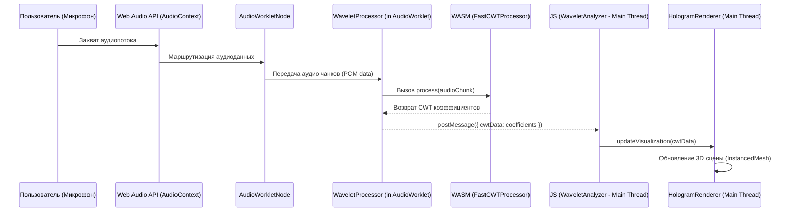
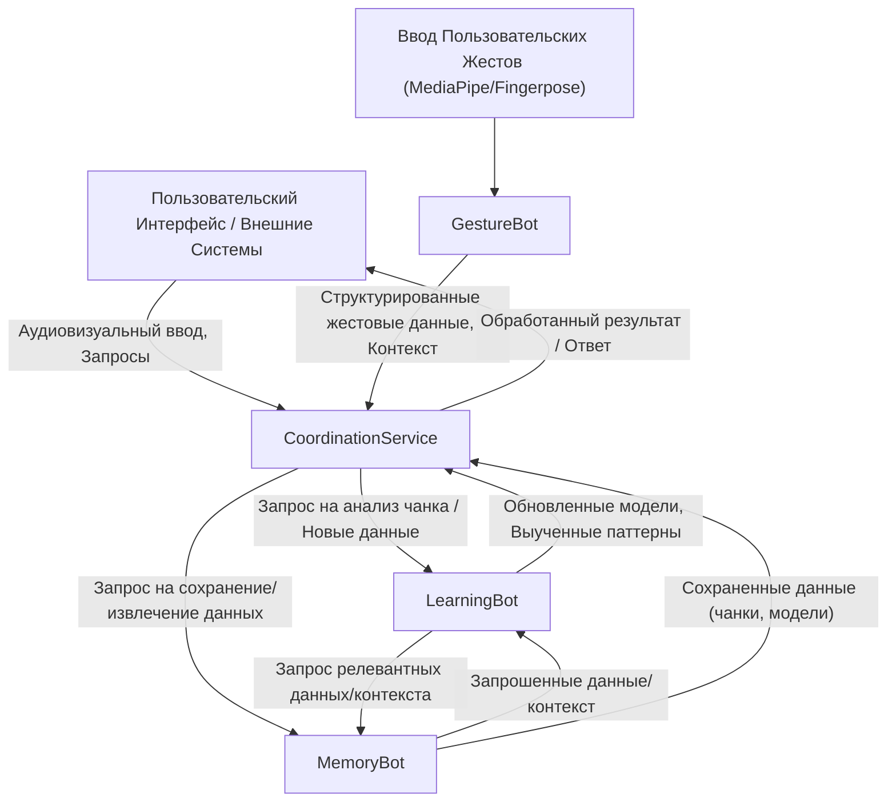

# NEOLANG WHITEPAPER 2.0 (WHITEGHOST)

## 1. Введение и Философия

### 1.1. Проблема устаревания текстовой коммуникации
Современный цифровой мир развивается стремительными темпами, однако наша основная форма онлайн-общения — текст — всё больше отстает. Текстовая коммуникация, несмотря на свою распространенность, оказывается неэффективной для передачи всей полноты человеческого опыта: нюансов интонации, эмоционального окраса и скрытых намерений. В эпоху, когда иммерсивные технологии открывают новые горизонты восприятия, текст становится узким местом, неспособным отразить богатство человеческого самовыражения и глубину передаваемой информации. Это приводит к недопониманию, потере контекста и общей фрустрации в цифровом взаимодействии. Пришло время для парадигмального сдвига, который позволит нам коммуницировать на более интуитивном и многогранном уровне.

### 1.2. Технология Трехмерной Аудиовизуализации: Новый Язык
Мы представляем "Технологию Трехмерной Аудиовизуализации" (ТТА) — не просто как очередной инструмент для профессионалов, а как фундаментальную основу для нового, мультисенсорного языка общения. ТТА призвана трансформировать абстрактные мысли, сложные концепции и мимолетные эмоции в динамичные, интерактивные трехмерные аудиовизуальные формы. Основываясь на идее преобразования звуковых волн (включая голос) в модифицируемые 3D-модели, эта технология пойдет дальше, интегрируя жестовые и, в перспективе, биометрические данные для формирования этих живых информационных скульптур. Цель — создать более интуитивный, информационно насыщенный и потенциально универсальный способ коммуникации, способный преодолеть существующие языковые барьеры и обеспечить более глубокое и точное взаимопонимание между людьми.

### 1.3. Жестовая Операционная Система и AI "Триа"
Для взаимодействия с этим новым аудиовизуальным языком и окружающим цифровым миром мы разрабатываем "Жестовую Операционную Систему" (ЖОС). ЖОС будет интуитивной средой, где приоритет отдан естественным формам ввода — жестам и голосу, обеспечивая бесшовное и органичное управление. Ядром этой системы и всей платформы Neolang является "Триа" — не просто набор алгоритмов, а эволюционирующий искусственный интеллект. Триа предназначена для понимания, интерпретации и даже совместного с пользователем создания аудиовизуальных выражений в рамках нового языка. Её обучение, основанное на анализе "чанков" (фрагментов данных, объединяющих жест, аудио/видео контекст и биометрические сигналы) и принципах "Absolute Zero Reasoning" (AZR), позволит ей постоянно совершенствоваться (детали см. в Разделе 3). Триа — это центральный элемент нашей философии, нацеленной на создание революционной парадигмы коммуникации и взаимодействия человека с информацией и друг с другом.

## 2. Техническая Детализация и Архитектура
### 2.1. Анализ Аудиопотока: Непрерывное Вейвлет-Преобразование (CWT)
Для глубокого и точного анализа аудиопотока в реальном времени, что является основой для создания живых аудиовизуальных форм, мы используем Непрерывное Вейвлет-Преобразование (CWT).

#### 2.1.1. Выбор CWT вместо FFT
В отличие от традиционного Быстрого Преобразования Фурье (FFT), которое предоставляет либо хорошее временное разрешение, либо хорошее частотное разрешение, но не оба одновременно, CWT предлагает адаптивное разрешение. Это означает, что CWT способно обеспечить высокую детализацию как по времени для высокочастотных компонентов, так и по частоте для низкочастотных компонентов сигнала. Такая особенность критически важна для нашей задачи — создания детализированных и отзывчивых аудиовизуализаций, способных отразить тончайшие изменения в звуке, что является ключевым для нового языка общения. FFT, с его фиксированным размером окна, не может обеспечить такой уровень детализации одновременно в обеих областях.

#### 2.1.2. Вейвлет Морле
В качестве базисного вейвлета выбран вейвлет Морле. Этот выбор обусловлен его оптимальным соотношением локализации в частотно-временной области. Вейвлет Морле представляет собой комплексную экспоненту, модулированную Гауссовой функцией, что позволяет ему эффективно захватывать как амплитудные, так и фазовые характеристики аудиосигнала. Это делает его особенно подходящим для анализа музыкальных и речевых сигналов, где важны и тональные, и переходные характеристики звука, формирующие основу для их трехмерного представления.

### 2.2. Реализация на WebAssembly
Для достижения максимальной производительности вычислений CWT, которые являются ресурсоемкими, ядро анализа аудиопотока реализовано на C++ и скомпилировано в WebAssembly (WASM).

#### 2.2.1. C++ Модуль: `FastCWTProcessor`
`FastCWTProcessor` — это C++ класс, инкапсулирующий логику быстрого CWT. Он спроектирован для максимальной производительности и включает следующие ключевые аспекты:
*   **Обработка Аудиобуферов:** Принимает на вход блоки аудиоданных (например, по 1024-2048 семплов).
*   **Применение Вейвлетов:** Реализует свертку аудиосигнала с масштабированными версиями вейвлета Морле. Для ускорения свертка выполняется в частотной области с использованием FFT (через библиотеку FFTW).
*   **Вывод Коэффициентов:** Генерирует матрицу CWT-коэффициентов (скейлограмму), представляющую амплитуду сигнала в различных частотно-временных точках.
*   **Оптимизации:** Включает предварительное вычисление и кэширование FFT вейвлетов Морле на различных масштабах при инициализации, что значительно ускоряет обработку в реальном времени.

#### 2.2.2. JS-обертка: `WaveletAnalyzer`
`WaveletAnalyzer` — это JavaScript класс, который служит мостом между браузерной средой и WASM-модулем `FastCWTProcessor`. Его функции включают:
*   **Управление Жизненным Циклом WASM:** Загрузка, инстанцирование и управление памятью WASM-модуля.
*   **Интерфейс с Web Audio API:** Интегрируется с `AudioWorklet`, что позволяет выполнять анализ аудио в отдельном потоке, не блокируя основной поток браузера и интерфейс пользователя. `WaveletAnalyzer` получает аудиоданные от `AudioWorkletNode`.
*   **Передача Данных:** Организует передачу аудиоданных в WASM и получение результатов CWT (массива коэффициентов) обратно в JavaScript.
*   **Обработка Сообщений:** Координирует взаимодействие между основным потоком и `AudioWorkletProcessor` через систему сообщений.

#### 2.2.3. Пайплайн Данных (Диаграмма Последовательности)
Ниже представлена диаграмма последовательности, иллюстрирующая поток данных от захвата аудио до обновления визуализации:

### 2.3. Стратегии Оптимизации
Для обеспечения плавной и отзывчивой работы системы в реальном времени применяются следующие стратегии оптимизации:

#### 2.3.1. Рендеринг: `InstancedMesh`
Для эффективного рендеринга большого количества схожих объектов, формирующих визуализацию (например, отдельных элементов спектрограммы или частиц в объемной форме), используется `THREE.InstancedMesh` из библиотеки Three.js. Этот подход позволяет отрисовать множество экземпляров одного объекта (геометрии и материала) одним вызовом отрисовки (draw call), значительно снижая нагрузку на CPU и GPU по сравнению с созданием и рендерингом каждого элемента по отдельности.

#### 2.3.2. Передача Данных: `SharedArrayBuffer`
Для минимизации задержек и накладных расходов на копирование данных между `AudioWorklet` (где выполняется CWT-анализ) и основным потоком JavaScript (где происходит рендеринг) планируется использование `SharedArrayBuffer`. Это позволит WASM-модулю записывать результаты CWT-анализа непосредственно в область памяти, разделяемую с основным потоком. Таким образом, отпадает необходимость в сериализации/десериализации и копировании больших массивов данных, что особенно критично для поддержания высокой частоты обновления визуализации.

#### 2.3.3. Кэширование Вейвлетов
Как упомянуто в описании `FastCWTProcessor`, одной из ключевых оптимизаций является предварительный расчет и кэширование преобразований Фурье (FFT) для вейвлета Морле на всех необходимых масштабах (частотах) во время инициализации модуля. Поскольку сам вейвлет не меняется в процессе работы, его FFT можно вычислить заранее. Это избавляет от необходимости многократно выполнять эти вычисления для каждого нового блока аудиоданных, тем самым существенно ускоряя основной цикл CWT-обработки в реальном времени.

## 3. Архитектура AI "Триа"
Искусственный интеллект "Триа" является сердцем платформы Neolang, обеспечивая понимание, интерпретацию и со-творчество в новом аудиовизуальном языке. Его архитектура построена на уникальных принципах обучения и модульной экосистеме ботов.

### 3.1. Фундаментальные Принципы Обучения

#### 3.1.1. "Медленное обучение"
"Медленное обучение" (Slow Learning) — это парадигма, лежащая в основе развития Триа. В отличие от традиционных моделей ИИ, обучаемых на огромных, статичных наборах данных в один или несколько этапов, Триа спроектирована для непрерывного, инкрементального обучения. Подобно человеческому познанию, она эволюционирует с течением времени, постепенно накапливая знания и улучшая свое понимание через анализ реальных взаимодействий с пользователями и окружающей средой. Этот подход нацелен на формирование глубокого, контекстуально-зависимого понимания, а не на поверхностное распознавание паттернов. "Медленное обучение" позволяет Триа адаптироваться к новым ситуациям, нюансам коммуникации и индивидуальным особенностям пользователей, постоянно совершенствуя свои способности.

#### 3.1.2. Absolute Zero Reasoning (AZR)
Absolute Zero Reasoning (AZR) — это фундаментальный принцип, определяющий, как Триа строит свою базу знаний и делает выводы. AZR подразумевает, что Триа стремится формировать понимание "с нуля", основываясь на непосредственно наблюдаемых данных и фундаментальных логических принципах, минимизируя при этом зависимость от предварительно заложенных человеческих предубеждений, эвристик или жестко запрограммированных правил. Вместо того чтобы полагаться на обширные априорные знания, Триа конструирует свое понимание мира путем анализа взаимосвязей в поступающих данных, проверки гипотез и постепенного выстраивания все более сложных моделей реальности. Это позволяет системе быть более гибкой, объективной и способной к обнаружению неочевидных закономерностей.

#### 3.1.3. Сбор Данных: Анонимизированные "Чанки"
Основным "топливом" для процесса "медленного обучения" Триа служат "чанки" (chunks). Чанк представляет собой дискретную, но контекстуально богатую единицу данных, включающую:
*   **Жестовую информацию:** Синхронизированные данные о жестах рук, их динамике и конфигурации (например, координаты ключевых точек, распознанные примитивы жестов).
*   **Аудиофрагменты:** Короткие записи голоса или других звуков, сопровождающих жест.
*   **Визуальный контекст (потенциально):** Краткие видеофрагменты или ключевые кадры, отражающие ситуацию, в которой был выполнен жест.
Ключевым аспектом сбора данных является **анонимизация**: все чанки обрабатываются таким образом, чтобы удалить любую персонально идентифицируемую информацию, обеспечивая полную конфиденциальность пользователей. Эти анонимизированные чанки позволяют Триа коррелировать жесты с аудиовизуальными выражениями, окружающим контекстом и, со временем, выявлять подразумеваемые значения и намерения, лежащие в основе нового языка.

### 3.2. Экосистема Ботов
Триа функционирует как распределенная система, состоящая из специализированных ботов, каждый из которых выполняет определенную роль. Эти боты взаимодействуют друг с другом под управлением центрального координатора.

#### 3.2.1. `GestureBot`
`GestureBot` является первичным интерфейсом для интерпретации пользовательских жестов. Его задачи:
*   **Захват и обработка сырых данных:** Получение данных от систем трекинга рук (например, MediaPipe, Fingerpose).
*   **Фильтрация и нормализация:** Удаление шумов, приведение данных к единому формату.
*   **Экстракция признаков:** Выделение ключевых характеристик жеста (например, траектория, скорость, конфигурация пальцев).
*   **Предварительная классификация:** Может выполнять начальное распознавание простых или часто используемых жестов.
*   **Форматирование для Триа:** Преобразование обработанных данных в структурированный формат, понятный для других компонентов Триа, в частности, для `CoordinationService` и `LearningBot`.

#### 3.2.2. `MemoryBot`
`MemoryBot` выполняет функции системы памяти Триа. Он отвечает за:
*   **Хранение "чанков":** Долговременное и среднесрочное хранение анонимизированных чанков данных.
*   **Управление базой знаний:** Хранение выученных паттернов, моделей, правил и ассоциаций, сформированных `LearningBot`.
*   **Контекстуальная память:** Сохранение информации о текущем и недавних взаимодействиях для поддержания контекста диалога или сеанса работы.
*   **Пользовательские профили (анонимизированные):** Хранение информации о предпочтениях и особенностях взаимодействия отдельных пользователей (в анонимизированном виде) для персонализации опыта.
*   **Быстрый поиск и извлечение:** Предоставление релевантной информации другим ботам по запросу.

#### 3.2.3. `LearningBot`
`LearningBot` — это ядро процесса "медленного обучения" и реализации принципов AZR. Его функции:
*   **Анализ новых "чанков":** Глубокий анализ поступающих от `GestureBot` (через `CoordinationService`) чанков.
*   **Выявление паттернов и корреляций:** Поиск закономерностей между жестами, аудио, визуальным контекстом и реакциями системы/пользователя.
*   **Обновление моделей Триа:** Модификация и расширение внутренних представлений и моделей знаний Триа на основе новых данных.
*   **Генерация гипотез:** Формирование и проверка гипотез о значениях и функциях новых жестов или их комбинаций.
*   **Адаптация и эволюция:** Обеспечение постепенного развития и совершенствования понимания и возможностей Триа.

#### 3.2.4. `CoordinationService`
`CoordinationService` действует как центральный диспетчер или "нервный узел" экосистемы ботов Триа. Его задачи:
*   **Маршрутизация информации:** Прием данных от `GestureBot` и других источников, и их направление соответствующим ботам (`LearningBot`, `MemoryBot`).
*   **Управление задачами:** Распределение задач между ботами (например, "проанализировать этот чанк", "сохранить эту информацию", "найти релевантный контекст").
*   **Обеспечение когерентности:** Поддержание согласованной работы всех компонентов системы.
*   **Интерфейс с внешним миром:** Передача результатов работы Триа (например, интерпретации, сгенерированные ответы) во внешние системы, такие как пользовательский интерфейс.
*   **Управление потоками данных:** Контроль за обменом информацией между ботами.

#### 3.2.5. Схема Взаимодействия Ботов (Диаграмма)
Следующая диаграмма иллюстрирует основные потоки данных и взаимодействия в экосистеме ботов Триа:

### 3.3. Оркестрация Ботов: LangChain/LangGraph
Для построения, соединения и управления сложными взаимодействиями между ботами в рамках `CoordinationService` и для реализации логики самих ботов (особенно `LearningBot` и `GestureBot`) будут активно использоваться фреймворки LangChain и/или LangGraph. Эти инструменты предоставляют мощные абстракции для создания цепочек (chains) или графов (graphs) операций, включающих вызовы к моделям ИИ, обработку данных, управление состоянием и взаимодействие с внешними источниками данных.

Использование LangChain/LangGraph позволяет:
*   **Модульность:** Разрабатывать каждого бота и его внутренние компоненты как независимые, но легко соединяемые модули.
*   **Гибкость:** Легко конструировать и модифицировать сложные потоки обработки информации и принятия решений, необходимые для реализации "медленного обучения" и AZR.
*   **Интеграция:** Упростить интеграцию с различными моделями машинного обучения, базами данных (для `MemoryBot`) и другими сервисами.
*   **Масштабируемость:** Обеспечить основу для будущего расширения функциональности Триа путем добавления новых ботов или усложнения существующих графов обработки.

Эти фреймворки играют роль "нервной системы" для Триа, позволяя ей выполнять сложные когнитивные задачи через скоординированную работу ее специализированных компонентов.

## 4. Пользовательский Опыт (UX/UI)
Пользовательский опыт (UX) и интерфейс (UI) в Neolang разрабатываются с учетом инновационной природы проекта, стремясь сделать взаимодействие с "Технологией Трехмерной Аудиовизуализации" и "Жестовой Операционной Системой" интуитивно понятным и комфортным.

### 4.1. Интерактивный Тур по Интерфейсу
Для помощи пользователям в освоении новой парадигмы взаимодействия будет интегрирован интеллектуальный интерактивный тур.

#### 4.1.1. Механика на Базе Mistral Small
Основой интерактивного тура станет компактная языковая модель (LLM), например, Mistral Small или аналогичная по производительности и размеру. Эта модель будет обеспечивать работу интеллектуального гида, способного:
*   **Контекстуально понимать действия пользователя:** Отслеживать, с какими элементами интерфейса взаимодействует пользователь и какие функции пытается использовать.
*   **Предоставлять релевантную помощь:** Предлагать подсказки, объяснения и инструкции в зависимости от текущего контекста пользователя.
*   **Обучать принципам Neolang:** Помогать пользователям понять философию "Технологии Трехмерной Аудиовизуализации" и освоить основные жесты "Жестовой Операционной Системы".
*   **Отвечать на вопросы:** В перспективе, гид сможет отвечать на простые вопросы пользователя о функциях системы.
Цель гида — не просто провести пользователя по заранее заданному сценарию, а динамически адаптироваться к его поведению, предлагая помощь именно тогда, когда она необходима.

#### 4.1.2. Озвучка (`Web Speech API`) и Подсветка Элементов
Для повышения вовлеченности и доступности интерактивный тур будет использовать мультимодальный подход:
*   **Голосовые инструкции:** Все объяснения и подсказки гида будут озвучиваться с использованием `Web Speech API` (Text-to-Speech). Это позволит пользователям получать информацию, не отвлекаясь от интерфейса, и сделает тур более естественным и доступным, особенно для людей с нарушениями зрения или предпочитающих аудиальное восприятие.
*   **Визуальная подсветка:** Одновременно с голосовыми инструкциями, элементы пользовательского интерфейса, к которым относится объяснение гида, будут визуально подсвечиваться. Это может быть реализовано через анимацию, изменение стиля (например, временная рамка или увеличение), или эффект фокуса. Такая подсветка поможет пользователю легко идентифицировать обсуждаемые элементы и следовать инструкциям гида.

### 4.2. Прогрессивное Веб-Приложение (PWA) и Локальное Хранение
Для обеспечения лучшего пользовательского опыта и расширения возможностей приложения, Neolang будет разрабатываться как Прогрессивное Веб-Приложение (PWA).

#### 4.2.1. Предложение Установки Приложения
Система будет стремиться предложить пользователю установить PWA для более тесной интеграции с его устройством:
*   **Обнаружение совместимости:** Приложение будет проверять, поддерживает ли браузер пользователя установку PWA.
*   **Ненавязчивое предложение:** В случае поддержки, пользователю будет предложено добавить приложение на главный экран (Add to Home Screen) или установить его как отдельное приложение. Это предложение будет сделано тактично, чтобы не прерывать основной пользовательский сценарий.
*   **Преимущества PWA:** Установка PWA обеспечит быстрый доступ к приложению (через иконку на рабочем столе/в списке приложений), возможность работы в автономном режиме (для некоторых функций), и в целом более привычный опыт использования, схожий с нативными приложениями.

#### 4.2.2. Согласие на Локальное Хранение Данных и Юридические Аспекты
Neolang может требовать сохранения некоторых данных локально на устройстве пользователя для улучшения производительности и функциональности. Этот процесс будет строго регламентирован:
*   **Прозрачное получение согласия:** Перед активацией функций, требующих локального хранения (например, через IndexedDB, Cache API), приложение запросит явное согласие пользователя. В запросе будет четко объяснено:
    *   Какие именно данные будут храниться (например, пользовательские настройки интерфейса, кэшированные ресурсы, анонимизированные "чанки" перед их отправкой на сервер для обучения Триа, или локальные фрагменты моделей ИИ для ускорения работы).
    *   С какой целью эти данные сохраняются (например, для персонализации, ускорения загрузки, обеспечения оффлайн-доступа к некоторым функциям).
    *   Как долго данные будут храниться и как пользователь может ими управлять (например, очистить кэш, удалить сохраненные данные).
*   **Юридические аспекты и отказ от ответственности:** В рамках процесса получения согласия или в легкодоступном разделе "О программе / Правовая информация" будет размещен следующий текст или его эквивалент:
    > "Программное обеспечение Neolang является проектом с открытым исходным кодом и предоставляется 'как есть' ('as is'), без каких-либо явных или подразумеваемых гарантий. Используя данное программное обеспечение, вы принимаете на себя все риски ('на свой страх и риск'), связанные с его работой, управлением данными и экспериментальным характером функций искусственного интеллекта 'Триа'. Разработчики не несут ответственности за возможную потерю данных, некорректную работу функций или любые другие последствия его использования. Пользователь несет полную ответственность за соблюдение применимых законов при использовании приложения, включая законы о защите данных и интеллектуальной собственности."
    Такое уведомление необходимо для информирования пользователей об экспериментальном статусе проекта и их ответственности.

## 5. Безопасность и Приватность
Проект Neolang ставит во главу угла обеспечение безопасности данных и защиту приватности пользователей. Эти принципы являются фундаментальными для всех аспектов разработки и функционирования платформы.

### 5.1. Политика Обработки Данных
Наша политика обработки данных основана на следующих ключевых обязательствах:
*   **Приоритет приватности:** Мы стремимся обеспечить максимальную защиту личной информации пользователей.
*   **Минимизация сбора данных:** Мы собираем только те данные, которые абсолютно необходимы для функционирования системы и улучшения ее возможностей, в частности, для обучения AI "Триа".
*   **Анонимизация по умолчанию:** Везде, где это возможно, данные подвергаются анонимизации или агрегации для устранения или минимизации риска идентификации пользователя.
*   **Прозрачность и контроль пользователя:** Пользователи будут четко информированы о том, какие данные собираются и как они используются. Мы стремимся предоставить пользователям контроль над их данными, включая возможность участвовать или не участвовать в сборе данных для обучения ИИ.
*   **Целевое использование:** Основной и единственной целью сбора данных (в частности, "чанков") является совершенствование AI "Триа", улучшение точности распознавания нового языка и общего пользовательского опыта. Данные не будут использоваться для коммерческого профилирования пользователей, таргетированной рекламы или других целей, не связанных напрямую с развитием платформы Neolang.
*   **Открытый исходный код:** Открытость кода позволяет сообществу проводить аудит механизмов безопасности и обработки данных.

### 5.2. Локальная Обработка и Анонимизация

**Ключевой Аспект Безопасности: Обработка на Устройстве**

Мы хотим предельно ясно и однозначно заявить: **сырые аудио- и видеопотоки, захватываемые с микрофона и камеры пользователя, не покидают устройство пользователя для хранения или обработки на стороне сервера в их исходном, необработанном виде.**

Вся чувствительная первичная обработка данных происходит локально, непосредственно в браузере пользователя или на его устройстве:
*   **Анализ аудио (CWT):** Непрерывное вейвлет-преобразование аудиопотока выполняется локально с помощью WebAssembly модуля (`FastCWTProcessor`). На сервер не передается сырой звук голоса пользователя.
*   **Анализ жестов:** Первичный анализ видеопотока с камеры для распознавания жестов (например, с использованием MediaPipe/Fingerpose) также осуществляется на стороне клиента. Исходные изображения или видеопоток с камеры не отправляются на сервер.

**"Чанки" для Обучения Триа: Состав и Анонимизация**

Для обучения и совершенствования AI "Триа" на сервер могут отправляться так называемые "чанки". Эти чанки формируются из результатов локальной обработки и **не содержат сырых персональных данных**. Состав "чанка" включает:

*   **Анонимизированные векторы жестов:** Это числовые представления или извлеченные признаки (features) жестов, характеризующие их форму, динамику и пространственное положение. Они не содержат информации, позволяющей визуально реконструировать руки пользователя или окружающую обстановку.
*   **Производные аудио метаданные/характеристики:** Вместо сырого аудио, в "чанк" включаются результаты его обработки, такие как:
    *   Векторы коэффициентов CWT, отражающие спектрально-временные характеристики звука.
    *   Другие извлеченные акустические признаки (например, характеристики тембра, ритма, интонации в обезличенном виде).
    *   В исключительных случаях, если для обучения критически важна связь конкретного звукового паттерна с жестом (например, для калибровки специфических звуко-жестовых команд), в "чанк" могут включаться очень короткие, строго ограниченные по длительности аудиофрагменты. Такие случаи будут отдельно оговариваться в политике приватности, и к таким фрагментам будут применяться дополнительные меры по удалению идентифицирующей информации, если это технически возможно (например, изменение тональности голоса, фильтрация). Однако основной фокус — на производных, не идентифицирующих данных.
*   **Контекстуальные метаданные:** Это обезличенная информация, описывающая контекст взаимодействия, в котором был создан "чанк". Например, это может быть тип выполняемой задачи (если пользователь добровольно предоставил эту информацию), активные инструменты интерфейса, или общая категория взаимодействия. Эта информация помогает Триа лучше понимать ситуации использования нового языка, но не идентифицирует пользователя.

**Процесс Анонимизации:**
Все компоненты "чанка" перед отправкой на сервер проходят процедуру анонимизации, направленную на удаление или маскировку любой информации, которая может прямо или косвенно привести к идентификации пользователя.

**Контроль Пользователя:**
Пользователи будут иметь полный контроль над своим участием в процессе улучшения Триа. Будет предоставлена явная возможность согласиться или отказаться от отправки "чанков" для обучения. Это решение может быть изменено пользователем в любой момент через настройки приложения. Механизмы получения согласия подробно описаны в разделе 4.2.2 "Согласие на Локальное Хранение Данных и Юридические Аспекты".

Мы убеждены, что такой подход, сочетающий локальную обработку чувствительных данных с тщательной анонимизацией "чанков" для обучения, обеспечивает необходимый баланс между развитием интеллектуальных функций системы и безусловным соблюдением приватности пользователей.

## 6. Экономика Проекта ("HoloGraph")
Экономическая модель проекта Neolang, условно названная "HoloGraph", призвана стимулировать развитие и обогащение искусственного интеллекта "Триа" через активное участие сообщества. Она отходит от сложных и спекулятивных моделей, предложенных в ранних версиях концепции, фокусируясь на прозрачном вознаграждении за реальный вклад в обучение AI.

### 6.1. Концепция "Интеллектуального Майнинга"
В контексте Neolang 2.0, "интеллектуальный майнинг" — это процесс, посредством которого пользователи напрямую способствуют росту и совершенствованию AI "Триа". Вместо традиционных механизмов консенсуса, таких как Proof-of-Work (доказательство работы) или Proof-of-Stake (доказательство доли), HoloGraph базируется на принципе **"Proof-of-Contribution" (доказательство вклада)** или **"Proof-of-Value" (доказательство ценности)**.

Этот вклад заключается в предоставлении системе высококачественных, анонимизированных "чанков" данных (детализированы в разделе 5.2). Пользователи, таким образом, "майнят" ценность не путем вычислительных затрат или удержания активов, а путем предоставления уникальных и полезных данных, которые служат "пищей" для "медленного обучения" Триа. Чем качественнее и разнообразнее эти данные, тем быстрее и эффективнее Триа сможет осваивать новый аудиовизуальный язык и понимать нюансы человеческого общения.

### 6.2. Вознаграждение за "Чанки"
Система HoloGraph предусматривает механизм стимулирования пользователей, которые добровольно решают участвовать в процессе обучения Триа путем предоставления своих "чанков".

*   **Токены Вознаграждения:** Пользователи, чьи "чанки" принимаются системой для обучения AI, будут вознаграждены специальными токенами проекта (далее условно "HoloGraph Tokens" или "HGT"). Эти токены являются внутренней единицей ценности в экосистеме Neolang.

*   **Качество превыше Количества:** Ключевым принципом системы вознаграждений является акцент на *качестве и полезности* предоставляемых "чанков", а не просто на их количестве. Для реализации этого планируется разработка механизмов оценки:
    *   **Оценка Новизны и Релевантности:** Система будет стремиться определять, насколько "чанк" содержит новую информацию для Триа или насколько он релевантен текущим целям обучения (например, изучение редких жестов или специфических интонаций).
    *   **AI-ассистированная Оценка Качества:** В будущем возможна интеграция AI-моделей для предварительной оценки качества и информативности "чанков".
    *   **Потенциал для Комьюнити-Валидации:** Рассматривается возможность внедрения механизмов, где сообщество может участвовать в оценке и валидации "чанков", особенно тех, что представляют сложные или неоднозначные случаи.
    *   **Дифференцированное Вознаграждение:** "Чанки", которые вносят значительный вклад в улучшение понимания Триа (например, помогают ей освоить новый сложный жест или разрешить неоднозначность в интерпретации), могут вознаграждаться выше.

*   **Предназначение Токенов (HGT):**
    Хотя детальная токеномика будет прорабатываться в отдельных документах, предполагается следующая потенциальная полезность HGT в экосистеме Neolang:
    *   **Доступ к Премиум-Функциям:** Возможность использования токенов для разблокировки расширенных функций платформы, кастомизации или раннего доступа к новым возможностям.
    *   **Участие в Управлении (Governance):** Владельцы токенов могут получить право голоса по некоторым вопросам развития платформы, определения приоритетов в обучении Триа или другим аспектам, касающимся сообщества.
    *   **Стейкинг и Другие Механизмы DeFi:** В долгосрочной перспективе, если это будет соответствовать целям проекта, могут быть рассмотрены механизмы стейкинга токенов или их интеграция с другими децентрализованными финансовыми инструментами.
    *   **Обмен на Биржах:** Как очень долгосрочная перспектива, при достижении проектом значительной зрелости и широкого распространения, возможен листинг токенов на криптовалютных биржах.

**Философия Экономики:**
Экономическая модель HoloGraph стремится создать симбиотические отношения между пользователями и AI "Триа". Пользователи, обогащая интеллект Триа своими данными, получают за это справедливое вознаграждение, что, в свою очередь, стимулирует дальнейшее развитие и совершенствование платформы. Это способствует созданию децентрализованного, управляемого сообществом подхода к построению глобального, интуитивно понятного языка будущего. Данная модель значительно упрощена по сравнению с первоначальными идеями (изложенными в NEOLANG WHITEPAPER 1.1), фокусируясь на прямой и понятной связи: **вклад ценных данных = вознаграждение**.

## 7. Дорожная Карта (Roadmap)
Развитие проекта Neolang планируется поэтапно, обеспечивая постепенное наращивание функциональности, обучение AI "Триа" и расширение пользовательского опыта.

### 7.1. Краткосрочные Цели (ближайшие 3-6 месяцев) - Фаза "Фундамент"
На этом этапе закладываются основы технологического стека и ключевых компонентов системы.

*   **Core Technology (CWT, WASM, Visualization):**
    *   **`FastCWTProcessor` (Alpha):** Разработка и тестирование альфа-версии C++ модуля `FastCWTProcessor`, скомпилированного в WebAssembly. Интеграция с `AudioWorklet` для анализа аудиопотока в реальном времени.
    *   **Базовый Рендеринг Голограммы:** Создание `HologramRenderer` с использованием `THREE.InstancedMesh` для отображения простой 3D голограммы, динамически изменяющейся на основе данных от CWT.
    *   **Оптимизация Передачи Данных:** Реализация `SharedArrayBuffer` для эффективной и быстрой передачи данных (результатов CWT) между `AudioWorklet` и основным потоком JavaScript, минимизируя задержки.
*   **AI "Триа" (Сбор "Чанков", Разработка Ботов):**
    *   **`GestureBot` (Начальная Версия):** Разработка первой версии `GestureBot`, способного захватывать сырые данные о жестах (например, от MediaPipe) и выполнять их базовую обработку (например, выделение ключевых точек).
    *   **Структура "Чанка":** Проектирование и начальная реализация формата данных для "чанков", включая анонимизированные векторы жестов и извлеченные аудио-характеристики.
    *   **Инфраструктура для Сбора "Чанков":** Настройка базовой серверной инфраструктуры и API для безопасного приема и хранения анонимизированных "чанков" данных от пользователей (с их согласия).
*   **UX/UI (Интерактивный Тур, PWA):**
    *   **Прототип PWA:** Разработка функционального прототипа Прогрессивного Веб-Приложения (PWA) с возможностью аудиоввода, базовой визуализацией и первичной структурой интерфейса.
    *   **Концепция Интерактивного Тура:** Детальная проработка концепции и сценариев для интерактивного обучающего тура, определение ключевых точек взаимодействия.
*   **HoloGraph Economy (Токеномика):**
    *   **Исследование Токеномики:** Глубокое исследование и определение основных параметров токеномики для будущих токенов "HoloGraph", включая модели эмиссии, распределения и стимулирования.
*   **Community & Testing:**
    *   **Запуск Сайта Проекта:** Создание и запуск предварительного веб-сайта или лендинг-пейдж проекта с доступом к WHITEGHOST Whitepaper и основной информацией.
    *   **Внутреннее Тестирование:** Начало интенсивного внутреннего тестирования основного пайплайна аудиовизуализации (захват аудио, CWT-анализ, рендеринг).

### 7.2. Среднесрочные Цели (6-12 месяцев) - Фаза "Эволюция Триа и UX"
Этот этап фокусируется на развитии интеллекта "Триа", улучшении пользовательского опыта и запуске первых программ для сообщества.

*   **Core Technology (CWT, WASM, Visualization):**
    *   **Стабильная Бета-Версия Визуализации:** Выпуск бета-версии системы аудиовизуализации с повышенной стабильностью, производительностью и качеством графики.
    *   **Интеграция Базовых Жестовых Команд:** Реализация управления параметрами визуализации (например, цвет, масштаб, форма) с помощью базовых жестов, как описано в `docs/01_ARCHITECTURE/audio_visualization_architecture.md`.
*   **AI "Триа" (Сбор "Чанков", Разработка Ботов, Обучение):**
    *   **Функциональный `MemoryBot`:** Разработка и внедрение `MemoryBot`, способного эффективно сохранять, индексировать и извлекать анонимизированные "чанки" и сопутствующие контекстуальные данные.
    *   **Первая Версия `LearningBot`:** Создание начальной версии `LearningBot`, реализующей принципы "медленного обучения" для анализа собранных "чанков" (например, распознавание простых паттернов в жестах и их связь с аудио-характеристиками).
    *   **Прототип `CoordinationService`:** Разработка прототипа `CoordinationService` с использованием LangChain/LangGraph для базовой оркестрации взаимодействия между `GestureBot`, `MemoryBot` и `LearningBot`.
    *   **Запуск Программы Сбора Данных (Альфа):** Открытие альфа-программы для ограниченного числа пользователей по добровольному предоставлению "чанков" для обучения Триа.
*   **UX/UI (Интерактивный Тур, PWA):**
    *   **Реализация Интерактивного Тура:** Внедрение интерактивного тура на базе Mistral Small (или аналогичной LLM), с озвучкой через `Web Speech API` и динамической подсветкой элементов интерфейса.
    *   **Полноценное PWA:** Обеспечение полной функциональности PWA, включая надежные механизмы предложения установки приложения и расширенные возможности работы в оффлайн-режиме (кэширование ресурсов).
    *   **Механизм Согласия:** Внедрение прозрачного механизма получения согласия пользователя на локальное хранение данных и участие в программе сбора "чанков".
*   **HoloGraph Economy (Токеномика):**
    *   **Разработка Смарт-Контракта:** Создание смарт-контракта для токена "HoloGraph" (HGT) и разработка начальных механизмов распределения вознаграждений для участников программы сбора "чанков".
*   **Community & Testing:**
    *   **Закрытая Бета-Программа:** Запуск закрытой бета-программы для ранних последователей с целью тестирования функциональности, сбора обратной связи и активного вклада "чанков".
    *   **Создание Каналов Сообщества:** Организация официальных каналов для общения сообщества (например, Discord-сервер, форум).
    *   **CI/CD и `verify_imports.py`:** Интеграция скрипта `verify_imports.py` (для проверки корректности импортов Python-кода на бэкенде, если применимо) в пайплайн непрерывной интеграции и развертывания (CI/CD).

### 7.3. Долгосрочные Перспективы (1 год +) - Фаза "Расширение Экосистемы"
Долгосрочные цели направлены на полномасштабное развертывание платформы, значительное усложнение AI "Триа" и формирование устойчивой экосистемы.

*   **Core Technology (CWT, WASM, Visualization):**
    *   **Продвинутые Визуальные Эффекты:** Реализация сложных и настраиваемых визуальных эффектов, предоставление пользователям большего контроля над трехмерной средой и формами представления информации.
    *   **Многопользовательские Взаимодействия:** Исследование и разработка прототипов для многопользовательских взаимодействий в общем аудиовизуальном пространстве Neolang.
*   **AI "Триа" (Сбор "Чанков", Разработка Ботов, Обучение):**
    *   **Углубление AZR в `LearningBot`:** Развитие способностей `LearningBot` к "Absolute Zero Reasoning", позволяющих Триа делать более сложные выводы и генерировать новые знания на основе фундаментальных принципов.
    *   **Расширение Понимания Триа:** Обучение Триа распознаванию более сложных и нюансированных жестов, эмоциональных оттенков в голосе и абстрактных концепций, выражаемых через новый язык.
    *   **Продвинутое Использование LangGraph:** Применение расширенных возможностей LangGraph для создания сложных графов рассуждений и выполнения многоэтапных задач AI "Триа".
    *   **API для Триа:** Потенциальная разработка API, позволяющего сторонним разработчикам (с соответствующими разрешениями и в рамках политики безопасности) взаимодействовать с некоторыми функциями Триа.
*   **UX/UI (Интерактивный Тур, PWA):**
    *   **Развитие "Жестовой ОС":** Совершенствование концепции "Жестовой Операционной Системы" с добавлением более сложных и интуитивных способов взаимодействия с системой и данными.
    *   **Персонализированный Опыт:** Предоставление глубоко персонализированного пользовательского опыта, адаптирующегося к индивидуальным особенностям и предпочтениям пользователя на основе обучения Триа.
*   **HoloGraph Economy (Токеномика):**
    *   **Полноценное Развертывание Экономики HGT:** Запуск всех запланированных механизмов токеномики HoloGraph, включая системы вознаграждения, стейкинга (если применимо) и управления.
    *   **Расширение Полезности Токена:** Исследование новых вариантов использования токена HGT, включая возможные интеграции с другими платформами и сервисами в рамках Web3.
*   **Community & Testing:**
    *   **Публичный Релиз Платформы Neolang:** Официальный запуск платформы для широкой аудитории.
    *   **Непрерывное Развитие:** Постоянное улучшение платформы на основе обратной связи от сообщества, анализа использования и продолжающейся эволюции AI "Триа".
    *   **Децентрализованное Управление:** Постепенный переход к модели децентрализованного управления (DAO), если это будет соответствовать целям проекта и интересам сообщества, с использованием токенов HGT для голосования.

## 8. Тестирование
Учитывая инновационный и комплексный характер платформы Neolang, внедрение всеобъемлющей и многоуровневой стратегии тестирования является критически важным для обеспечения высокого качества, производительности, надежности и корректности работы системы.

### 8.1. Стратегия Тестирования
Наша стратегия тестирования охватывает различные уровни и аспекты проекта:

*   **Модульное тестирование (Unit Testing):** Каждый отдельный модуль и компонент системы (особенно критическая логика на C++ в `FastCWTProcessor`, JavaScript-модули фронтенда, компоненты AI "Триа") будет покрыт модульными тестами. Это позволит проверять корректность работы отдельных функций и классов в изоляции.
*   **Интеграционное тестирование (Integration Testing):** Будет проводиться тестирование взаимодействия между различными компонентами системы. Например:
    *   Корректность обмена данными между `AudioWorklet` и WASM-модулем `FastCWTProcessor`.
    *   Взаимодействие `GestureBot` с AI "Триа" (передача обработанных жестов, получение ответов).
    *   Связь между `WaveletAnalyzer` и `HologramRenderer`.
*   **Сквозное тестирование (End-to-End Testing):** Тестирование полных пользовательских сценариев, от ввода данных (аудио, жесты) до отображения результата и реакции системы. Это поможет убедиться, что вся система в целом работает корректно.
*   **Тестирование производительности (Performance Testing):** Оценка производительности ключевых компонентов и системы в целом под различными нагрузками.
*   **Пользовательское приемочное тестирование (UAT):** Привлечение реальных пользователей (в рамках альфа- и бета-программ) для получения обратной связи и выявления проблем, которые могут быть не очевидны для команды разработчиков.

#### 8.1.1. Тестирование Производительности Wasm-модуля
Модуль `FastCWTProcessor`, скомпилированный в WebAssembly, является ядром анализа аудиопотока, и его производительность критична для работы всей системы в реальном времени. Тестирование будет включать:
*   **Бенчмаркинг времени вычислений:** Измерение времени, затрачиваемого на CWT-обработку аудио буферов различного размера и сложности (например, с разным количеством масштабов вейвлета).
*   **Анализ использования памяти:** Мониторинг потребления памяти WASM-модулем для выявления и устранения потенциальных утечек памяти.
*   **Кросс-браузерная и кросс-платформенная производительность:** Убедиться, что производительность остается стабильной и приемлемой в различных браузерах (Chrome, Firefox, Safari, Edge) и на устройствах разной мощности, поддерживающих WebAssembly.
*   **Целевые показатели:** Проверка соответствия производительности заданным требованиям, например, обеспечение не менее 30 обновлений CWT-матрицы в секунду для плавной визуализации.

#### 8.1.2. Тестирование Точности Распознавания Жестов
Точность и надежность распознавания жестов — ключевой элемент "Жестовой Операционной Системы". Тестирование этого аспекта будет включать:
*   **Создание набора тестовых жестов:** Формирование разнообразной библиотеки эталонных жестов, включая как простые, так и сложные конфигурации и движения.
*   **Оценка `GestureBot`:** Тестирование `GestureBot` и интегрированных библиотек (например, Fingerpose, MediaPipe Hands) на способность корректно идентифицировать тестовые жесты в различных условиях:
    *   Различное освещение.
    *   Разная скорость выполнения жестов.
    *   Различная ориентация кисти руки относительно камеры.
*   **Метрики качества:** Измерение ключевых метрик, таких как частота ложноположительных (False Positive Rate) и ложноотрицательных (False Negative Rate) срабатываний.
*   **Итеративное улучшение:** Постоянное уточнение определений жестов, настроек алгоритмов распознавания и, при необходимости, дообучение моделей на основе результатов тестирования для повышения точности.

#### 8.1.3. Тестирование Стабильности UI
Пользовательский интерфейс, особенно динамическая 3D-визуализация, должен быть стабильным, отзывчивым и визуально корректным.
*   **Тестирование `HologramRenderer`:** Проверка стабильности работы рендерера `HologramRenderer` при подаче широкого диапазона входных данных CWT (например, экстремальные значения, быстро меняющиеся данные, отсутствие данных) для гарантии плавности анимаций и отсутствия артефактов рендеринга.
*   **Автоматизированные UI-тесты:** Использование фреймворков для автоматизации UI-тестирования (например, Selenium, Puppeteer, Playwright) для проверки стандартных сценариев взаимодействия пользователя с интерфейсом (навигация, использование элементов управления).
*   **Стресс-тестирование UI:** Проверка поведения интерфейса при интенсивных или длительных нагрузках, таких как быстрая последовательность жестовых команд или продолжительные сеансы работы, для выявления проблем с производительностью или утечками памяти на стороне клиента.
*   **Кросс-браузерная совместимость UI:** Обеспечение корректного отображения и функционирования всех элементов интерфейса в основных современных браузерах.

### 8.2. CI/CD и `verify_imports.py`
Для автоматизации процесса сборки, тестирования и развертывания проекта будет использоваться система непрерывной интеграции и непрерывного развертывания (CI/CD).
*   **Автоматизированное тестирование в CI:** Все модульные и ключевые интеграционные тесты будут автоматически запускаться в CI-пайплайне при каждом коммите или пул-реквесте. Это позволит оперативно выявлять и исправлять ошибки, не допуская их попадания в основную кодовую базу.
*   **`verify_imports.py`:** В состав CI-пайплайна будет интегрирован специализированный скрипт `verify_imports.py`. Его основная задача — автоматическая проверка корректности всех инструкций импорта модулей и зависимостей в кодовой базе проекта.
    *   **Назначение:** Учитывая многокомпонентную природу проекта (Python для бэкенда/инструментов, JavaScript для фронтенда, C++ для WASM), корректное управление зависимостями и импортами имеет решающее значение. Скрипт `verify_imports.py` будет статически анализировать код, чтобы убедиться, что все импортируемые модули существуют, доступны и используются правильно.
    *   **Предотвращение ошибок времени выполнения:** Это помогает предотвратить ошибки времени выполнения (runtime errors), связанные с отсутствующими или неверно указанными импортами, которые могут быть не очевидны на этапе разработки или при ручном тестировании.
    *   **Обеспечение целостности кода:** Скрипт способствует поддержанию целостности и согласованности кодовой базы, особенно при рефакторинге или обновлении зависимостей.
    *   **Раннее обнаружение проблем:** Интеграция в CI позволяет обнаруживать проблемы с импортами на ранней стадии, до того как они приведут к более серьезным сбоям в работе приложения.
CI/CD в сочетании с автоматизированными проверками, включая `verify_imports.py`, является важной частью нашей стратегии обеспечения качества, позволяя поддерживать высокий темп разработки при сохранении стабильности и надежности платформы.
